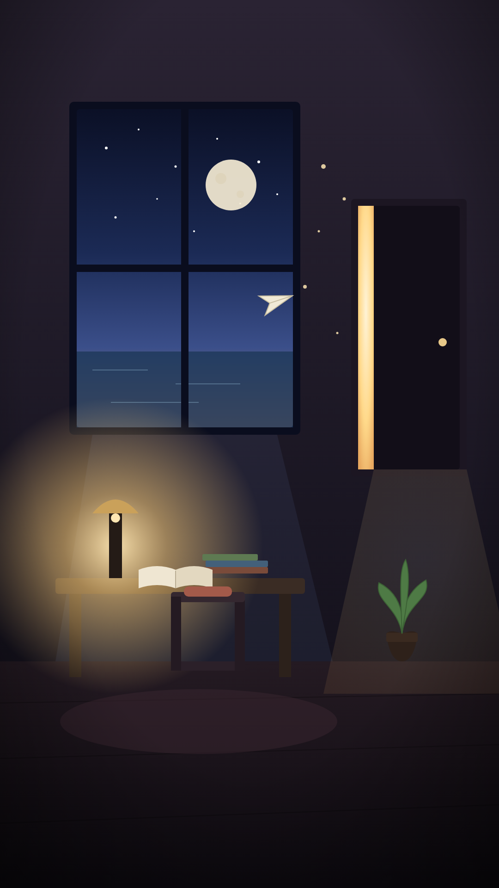

# 如果我的世界是一間房間 / If My World Were a Room

一幅 9:16（1080×1920）的象徵性畫面：夜裡一間被暖燈點亮的房間，一個人獨處卻仍與世界相連。



## 象徵元素

- **窗** — 朝向外界的渴望。窗外的月是恆久的指引，海平線是未知與開闊。
- **半掩的門** — 「下一步」與可能性；留著一道暖光的縫，象徵走出去的自由。
- **桌燈** — 專注與希望的核心，全室最亮的一點。
- **書（疊起／攤開）** — 累積的記憶與知識，以及此刻正在發生的思緒。
- **椅子與靠墊** — 獨處的自己，孤單但安歇。
- **植物** — 活著、生長的生命力。
- **紙飛機與光點** — 飛向窗外的願望與游移的念頭。

冷暖對比（內在燈光 vs 外界星海）加上漸暗暈影，把視線往內聚。

## 重新產生 PNG

原始檔為 `world_room.svg`，可直接編輯配色與構圖。用 Chromium + Playwright 重新輸出：

```bash
NODE_PATH=$(npm root -g) node render.js
```
