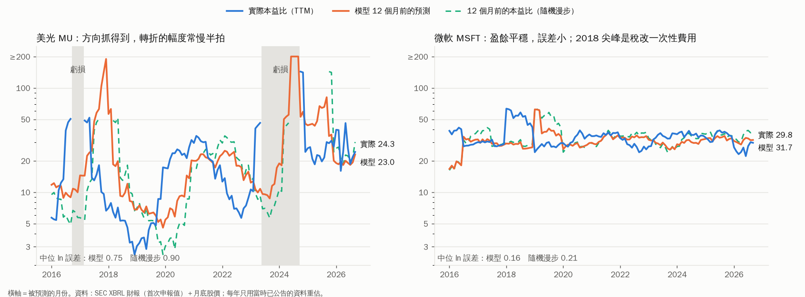

# 前瞻本益比模型：科技股，3–36 個月後

> 上一版（`projects/pe-model/`，在 `claude/macro-economy-asset-forecast` 分支）用 70 年總體數據回答
> 「大盤撐得起幾倍」。這一版回答的是另一個問題：**站在今天，這家公司 3–36 個月後的本益比是多少？**
> 不用歷史平均本益比，也不用產業標籤，只用當時看得到的財報、股價與殖利率。
>
> 設計的推導過程見 `DESIGN.md`，資料來源與陷阱見 `data/SOURCES.md`。

```
python3 pe_forecast.py predict MU                         # 今天 → 3–36 個月後（組合模型，§12）＋盈餘拆解
python3 pe_forecast.py predict MU --asof 2025-09          # 回到 2025-09，只用當時的資料
python3 pe_forecast.py predict MU --rev-growth=-0.2,-0.3,0 --margin 0.35,0.15,0.2   # 你的情境
python3 pe_forecast.py implied MU NVDA MSFT GOOGL         # 市場現價在賭什麼
python3 pe_forecast.py backtest && python3 report.py      # 全部回測，重算本文每一張表
python3 pe_forecast.py history MU --h 12                  # 過去每一次「12 個月前的預測」vs 實際
python3 lab_run.py                                        # §12：哪個預測距離、哪個方法最有效（約 6 分鐘）
```

---

## 0. 結論先講

0. **改良版（§12，2026-09-25）：主模型換成四個預測器的等權平均（組合模型），預測距離擴到 3–36 個月。**
   12 個月誤差 ±30%，「本益比不變」±38%（改善 18%）；用過去推到現在，72% 的公司組合比較準。
   **3 個月贏不了「本益比不變」，9–12 個月最有效**，18–36 個月看方向不看數字。「回到歷史本益比」當特徵也沒幫助。
   12 個月方向命中 68%，但點估計落在實際 ±20% 內只有 37%——用法是「方向＋區間」。盈餘可以自己給（`--earnings-growth`，§12.7）。
   **全美股版（§13）**：用全部 S&P 500 回測（475 家），12 個月誤差 ±25%、「本益比不變」±31%，方向命中 67%；
   訓練資料擴大到全部 S&P 500 是這一輪唯一明確的改善。報酬假設換成 CAPM beta 或產業歷史報酬都沒有更好。
   網頁可以查任何美股代號（3,199 家有季報，其中 3,072 家有預測）。
   **擴大到 Nasdaq-100、S&P 400／600、Russell 2000（§14）**：同一個模型不用改，12 個月誤差比「本益比不變」少 12–15%（Nasdaq-100 ±27% vs ±32%、Russell 2000 ±38% vs ±44%）；中小型股改用較寬的 80% 區間；不在主要指數的微型股 3–6 個月不要用。過程中修正了 SEC 股數單位錯誤（S&P 500 63 家），修正後 S&P 500 12 個月誤差 ±25%。
   以下 1–7 是原始版本（兩階段盈餘模型，現在是組合的成員之一）的結論，仍成立。
1. **本益比的變化只有兩個來源：股價報酬和盈餘成長。** 對科技股，12 個月本益比變化的變異有 **73–91%
   來自盈餘那一項**（表 5；IT 服務例外，47%）。盈餘是可以預測的，所以本益比有一大塊是可以預測的。
2. **模型在四個預測距離都贏過「本益比維持不變」（隨機漫步）；贏「歷史平均本益比」（舊思維）更多。**
   12 個月後的誤差 0.270 vs 隨機漫步 0.312 vs 歷史均值 0.335（ln PE 中位絕對誤差；0.27 ≈ 實際值的 ×/÷1.31）。
   樣本：68 家美股科技公司、2015–2026、每年只用當時已公告的資料重估（表 1）。
3. **「站在 12 個月前預測今天（2026-09）」**：11 家公司的中位 ln 誤差 **0.093（約 ±10%）**，
   本益比不變 0.361、5 年均值 0.224。MU：12 個月前預測 23.0，實際 24.3（表 6）。
4. **驗證過程推翻了原本設計的一半**：「內在價值 vs 股價的缺口會修正」**不成立**（γ ≈ +0.04，
   貴的股票沒有變便宜）；DCF 用歷史利潤率**完全解釋不了**橫斷面的本益比差異。
   但把 DCF 倒過來用——**反推市場現價隱含的長期利潤率**——它對「未來利潤率」有很強的預測力：
   市場押注利潤率結構性變高（>1.5 倍歷史）時，24 個月後真的高於歷史的比例 **80%**（§4）。
5. **記憶體「脫離循環」可以用資料量出來**：MU 上兩次盈餘高峰（2018、2022）時，市場隱含的長期淨利率
   只有歷史的 0.29–0.39 倍（＝押注崩跌，本益比 4–7 倍）；**這一次高峰（2026-09）是 2.82 倍**（＝押注延續，
   本益比 24 倍）。市場在 2024-06 MU 還在虧損時就已經押 3.63 倍，而兩年後的實際淨利率是 55.9%（§5）。
6. **只從科技股學到的規律，套到非科技股也大致成立**（§4b）：能源股 12 個月誤差比隨機漫步低 47%、軍工低 10%；電力股好壞參半。
7. **2026 年 CSP 的 GAAP 本益比不能直接比**：GOOGL、AMZN、META 的 TTM 淨利都含大額一次性項目（AI 公司持股評價利得、稅務費用）。
   GOOGL 的 GAAP 本益比 17，換成營業利益口徑約 32（§6、`results/snapshot_2026-09.md`）。

---

## 1. 第一性原理：本益比不是一個東西，是兩個東西的比

```
ln PE(t+h) − ln PE(t)  =  股價報酬(t→t+h)  −  盈餘成長(t→t+h)
```

這是恆等式，不是模型。它直接告訴你該怎麼設計：

| | 可預測嗎 | 為什麼 | 模型怎麼處理 |
|---|---|---|---|
| 盈餘成長 | **大部分可以** | 營收有慣性（訂單、合約、產能爬坡）、利潤率會回歸、存貨與毛利率斜率是領先訊號 | **模組 E**：從財報推出來 |
| 股價報酬 | **幾乎不行** | 可以預測就會被套利掉 | **假設**：預設＝資金成本（10 年期 + 5%），你可以改 |

**表 5：本益比 12 個月變化，變異有多少來自盈餘**（各產業中位數，2012 起）

| 產業 | 股價報酬波動 | 盈餘成長波動 | 盈餘占比 |
|---|---|---|---|
| software | 0.23 | 0.65 | **0.91** |
| semis | 0.30 | 0.49 | 0.76 |
| memory | 0.51 | 0.88 | 0.75 |
| hardware | 0.26 | 0.54 | 0.74 |
| internet | 0.27 | 0.73 | 0.73 |
| semicap | 0.39 | 0.61 | 0.73 |
| itservices | 0.21 | 0.23 | 0.47 |

個股：AMAT 0.81、STX 0.81、MSFT 0.80、MU 0.73、NVDA 0.58、GOOGL 0.55、**AAPL 0.28**（盈餘太穩，本益比幾乎全跟股價走）。
軟體的 0.91 裡有一部分是 GAAP 一次性項目（MSFT 2018 稅改費用讓 TTM 本益比從 30 跳到 60）——那一塊誰都預測不到。

---

## 2. 模型結構

```
PE(t+h) = 市值(t) × exp(報酬假設 × h/12) ÷ 預測淨利TTM(t+h)
                                                 │
                         模組 E：營收(t+h) × 淨利率(t+h)
                           ├ 營收成長 ← 近 4 季成長、最新一季加速度、存貨天數變化、毛利率斜率、
                           │           6 個月股價動能、P/S、E/P、市場隱含利潤率缺口
                           └ 淨利率   ← (TTM − 5年中位) 的回歸、最新季 vs TTM、毛利率斜率、存貨、
                                       6 個月股價動能、P/S、E/P、市場隱含利潤率缺口
                                                 ▲
                         模組 V（倒過來用）：現價 → 反推市場隱含的長期淨利率
```

- **係數用 68 家公司一起估**（Huber 穩健迴歸，每個預測距離各一組），不分產業——物理規律
  （存貨堆積 → 降價 → 利潤率掉）對所有公司一樣，差別在各家的訊號值。所以它能套到新公司、新結構。
- **沒有任何一個本益比的歷史平均值進入模型。** 本益比是算出來的：今天的市值 ÷ 預測的盈餘。
- **時點正確**：財報一律用**第一次申報的數字與申報日**（後來的重述不准用）；每年 1 月用當時為止的資料重估。
- 模組 V 是最小 DCF（前 3 年用模組 E 的預測，之後成長以 5 年半衰到 3%、利潤率收斂到長期值，
  再投資 = 營收增量 ÷ 公司自己的營收/投入資本比，折現率 = 10 年期 + 5%）。**它不直接預測股價**
  （§4 證明它做不到），而是解一個方程式：「長期淨利率要多高，這個 DCF 才等於現在的市值？」

---

## 3. 回測：到底準不準

**方法**：2015 年起每年 1 月重估，預測接下來 12 個月每個月底的 6／12／24／36 個月後本益比。
**選模期 2015–2021**：所有規格決策只看這段。**保留期 2022–2026**：不參與任何選擇，剛好包含 2023 記憶體崩盤與 AI 行情。
評分只在「實際盈餘為正、每個方法都有預測」的共同樣本上算（虧損時本益比沒有定義；E/P 版本見 `results/scores_ep.csv`）。

**表 1：ln PE 中位絕對誤差（越小越好；0.19 ≈ ×/÷1.21、0.27 ≈ ×/÷1.31、0.33 ≈ ×/÷1.39）**

| 方法 | 6 個月 | 12 個月 | 24 個月 | 36 個月 |
|---|---|---|---|---|
| **模型（報酬＝資金成本）** | **0.188** | **0.270** | **0.329** | **0.331** |
| 模型（報酬＝過去 10 年中位） | 0.188 | 0.276 | 0.322 | 0.332 |
| 模型（股價不動） | 0.196 | 0.290 | 0.380 | 0.430 |
| 隨機漫步（本益比不變） | 0.201 | 0.312 | 0.355 | 0.354 |
| 歷史均值（該公司過去 5 年） | 0.314 | 0.335 | 0.361 | 0.400 |
| 同業中位數 | 0.341 | 0.377 | 0.381 | 0.357 |

n = 6,643／6,208／5,489／4,811（公司×月）。

| 分期（模型 / 隨機漫步） | 6 個月 | 12 個月 | 24 個月 | 36 個月 |
|---|---|---|---|---|
| 選模期 2015–21 | 0.184 / 0.199 | 0.282 / 0.322 | 0.316 / 0.357 | 0.327 / 0.339 |
| **保留期 2022–26** | 0.193 / 0.205 | **0.250 / 0.296** | 0.373 / 0.350 | **0.364 / 0.454** |

保留期 24 個月輸給隨機漫步，原因在報酬假設不在盈餘：2022–26 科技股的實際報酬遠高於資金成本
（改用「過去 10 年中位報酬」時保留期 24 個月是 0.304，贏隨機漫步）。**這正是恆等式說的：報酬那一項預測不了。**

**表 2：方向命中率（本益比會升還是降）**：模型 64%／66%／64%／63%（6/12/24/36 個月）；歷史均值 58%／62%／62%／58%；同業中位數 55%／58%／61%／62%。

**表 3：盈餘預測本身**（誤差以 t 時點市值標準化，pp）

| | 6 個月 | 12 個月 | 24 個月 | 36 個月 |
|---|---|---|---|---|
| 模型 | 0.41 | 0.81 | 1.30 | 1.61 |
| 假設盈餘不變 | 0.49 | 0.94 | 1.55 | 2.16 |
| 模型比較準的比例 | 62% | 62% | 63% | 68% |

**表 4：分產業（12 個月）**

| 產業 | 公司 | 模型 | 隨機漫步 | 歷史均值 | 同業中位數 | 模型 vs 隨機漫步 |
|---|---|---|---|---|---|---|
| internet | 9 | 0.238 | 0.303 | 0.390 | 0.335 | −21% |
| semis | 12 | 0.259 | 0.327 | 0.383 | 0.507 | −21% |
| semicap | 4 | 0.301 | 0.370 | 0.285 | 0.328 | −19% |
| memory | 3 | 0.564 | 0.675 | 0.583 | 0.725 | −17% |
| hardware | 16 | 0.291 | 0.336 | 0.324 | 0.405 | −13% |
| itservices | 6 | 0.220 | 0.231 | 0.247 | 0.291 | −4% |
| software | 13 | 0.267 | 0.277 | 0.326 | 0.319 | −3% |

記憶體的絕對誤差最大（0.56），但相對改善排前段；軟體幾乎沒有改善（盈餘可預測的部分已經在股價裡了）。

**表 6：站在過去，預測 2026-09 的本益比**（11 家有 2026-09 股價的公司）

| 公司 | 2026-09 實際 | 12 個月前的模型 | 12 個月前的本益比 | 24 個月前的模型 | 36 個月前的模型 |
|---|---|---|---|---|---|
| MU | 24.3 | **23.0** | 30.2 | 48.4 | 36.5 |
| NVDA | 34.5 | 43.7 | 52.9 | 52.4 | 39.7 |
| MSFT | 29.8 | 31.9 | 38.0 | 35.1 | 24.4 |
| GOOGL | 25.8 | 23.5 | 25.7 | 22.8 | 21.8 |
| META | 27.0 | 24.9 | 26.4 | 26.2 | 22.6 |
| AMZN | 29.9 | 29.3 | 33.6 | 31.4 | 26.8 |
| AVGO | 59.0 | 60.2 | 84.7 | 63.0 | 20.3 |
| AMAT | 44.5 | 21.8 | 24.0 | 23.0 | 18.5 |
| LRCX | 57.6 | 24.6 | 32.2 | 22.6 | 21.1 |
| ORCL | 24.7 | 46.0 | 65.8 | 32.1 | 17.7 |
| AMD | 202.5 | 51.7 | 93.1 | 56.0 | 38.9 |

中位 ln 誤差：**12 個月前 0.093**（本益比不變 0.361、5 年均值 0.224）；24 個月前 0.263（0.455、0.373）；36 個月前 0.330（0.837、0.624）。
（這張表用的是回測資料：GOOGL、AMZN 的財報到 2026-Q1，「實際」本益比也是 GAAP 口徑，含 §6 講的一次性利得。）
只有 11 家，當例證，不當證明。錯最多的是半導體設備（AMAT、LRCX 被重新定價，股價漲、盈餘沒跟上）和 AMD（盈餘崩）。



---

## 4. 被資料推翻的假設（這一段最重要）

設計時（`DESIGN.md` §6）預先寫下三條否證條件。結果：

| 原本的假設 | 檢驗 | 結果 |
|---|---|---|
| 模組 E 能預測盈餘 | 12 個月 ln PE 誤差要贏隨機漫步 | ✅ 成立（0.270 vs 0.312；保留期 0.250 vs 0.296） |
| 股價會向內在價值修正 | 報酬 = a + γ·(ln 市值 − ln V)，γ 應為負 | ❌ **γ12 每年重估都是 +0.00 ～ +0.05**。貴的沒變便宜，反而略漲——觸發否證條件 3 |
| DCF 能解釋「為什麼 A 公司比 B 公司貴」 | ln PE 與 ln(V/盈餘) 的橫斷面相關（表 9） | ❌ **−0.40 ～ +0.01**，衰退半衰期從 1 年換到 12 年都一樣；同一天同業中位數是 +0.21 ～ +0.54 |

**為什麼 DCF 失敗**：它用公司自己的 5 年中位利潤率當長期值。市場定價的是**未來**的利潤率——
PLTR、CRWD 這種還在放大的公司、AI 之後的 MU，歷史利潤率都不代表未來。這正是你說的第 1 點，被資料證實了。

**把它倒過來就成功了**：不問「DCF 值多少」，改問「**要多高的長期淨利率，DCF 才等於現在的市值**」。（表 8）

| | 24 個月後淨利率偏離歷史的 R²：只用現在偏離 | ＋市場隱含偏離 | 市場押注變高（>1.5 倍）後真的高於歷史 | 押注變差（<0.67 倍）後真的低於歷史 |
|---|---|---|---|---|
| 選模期 2015–21 | 0.10 | **0.25** | **81%**（n=776） | 49%（n=1,249） |
| 保留期 2022–26 | 0.09 | **0.33** | **80%**（n=409） | 51%（n=253） |

**市場對「結構性變好」的押注大多是對的，對「會變差」的押注是擲銅板。**
所以隱含利潤率缺口被接回模組 E 當輸入（兩階段）。

**所有試過的規格**（`python3 ablation.py` 用目前的程式重跑，→ `results/ablation.csv`；報酬一律＝資金成本，最後一列除外）

| 規格 | 選模期 PE 誤差（6/12/24/36 平均） | 選模期盈餘誤差 24／36 個月（pp） | 保留期 PE 誤差平均 | 保留期盈餘誤差 24／36 |
|---|---|---|---|---|
| E0 財報＋股價動能＋P/S | 0.277 | 1.48 / 2.06 | 0.340 | 1.34 / 2.20 |
| E1 E0＋E/P | 0.281 | 1.39 / 1.91 | 0.324 | 1.38 / 2.08 |
| E2 只有財報、不看股價 | **0.275** | 1.48 / 2.10 | 0.338 | 1.60 / 2.57 |
| E3 E1＋循環性交互作用 | 0.287 | 1.38 / 1.92 | 0.326 | 1.41 / 2.02 |
| **E1＋兩階段隱含利潤率（最終版）** | 0.277 | **1.33 / 1.60** | **0.295** | **1.20 / 1.65** |
| 最終版，報酬＝過去 10 年中位 | 0.284 | 1.33 / 1.60 | 0.267 | 1.20 / 1.65 |

誠實的讀法：
- **在選模期，E0／E1／E2／最終版的本益比誤差差距只有 0.006，是雜訊等級。** 嚴格照「選模期本益比誤差最低」
  這條事先訂的規則，會選到 E2（只看財報）——它贏最終版 0.003。
- 最終版被選的理由是**盈餘預測本身**（模組 E 的工作）：選模期 24／36 個月盈餘誤差 1.33／1.60，其他規格 1.38–2.10；
  保留期同樣最好，而且保留期本益比誤差 0.295 明顯低於其他規格（≥0.324）。
  **開發時的規格決策是在較早的程式版本上做的**，這張表是最終程式碼的重跑；結論（採用兩階段、不採用 E3）不變。
- E2 的意義：**完全不看股價，只用財報，12 個月也贏隨機漫步**（選模期 0.274 vs 0.322）。股價資訊主要改善的是保留期。
- 報酬假設：選模期資金成本 0.277 < 過去 10 年中位 0.284 → 預設資金成本；保留期相反（AI 行情），見 §3。
- 原設計（V 路徑＋信念衰減）在開發中試過，12 個月誤差 0.312、偏誤 +0.11，已刪除；**那版程式沒有保留，這兩個數字不可重現**。

---

## 4b. 只學過科技股，套到非科技股行不行？（樣本外「領域」測試）

「存貨堆積 → 降價 → 利潤率掉」「利潤率回歸自己的結構水準」如果真的是物理規律，應該不只在科技股成立。
測試：模型**只用 68 家科技股訓練**，拿去預測從沒看過的能源、電力、軍工、TSLA（`python3 ood.py` → `results/ood.csv`）。

| 產業（公司） | 12 個月：模型 / 隨機漫步 | 模型 vs 隨機漫步 | 24 個月：模型 / 隨機漫步 | 方向命中（12 個月） | n（12 個月） |
|---|---|---|---|---|---|
| 能源（XOM、CVX、COP） | **0.233 / 0.442** | **−47%** | **0.253 / 0.611** | 80% | 164 |
| 軍工（LMT、NOC、RTX、GD、LHX） | 0.208 / 0.230 | −10% | 0.220 / 0.234 | 63% | 484 |
| 電力（VST、CEG、NRG） | 0.512 / 0.647 | −21% | 0.714 / 0.810 | 82% | 65 |

- **能源最強**：油價讓盈餘大起大落，但「利潤率回歸」的速度是可預測的——跟記憶體同一個機制。
- **軍工小贏**：盈餘穩，本益比主要跟股價走（跟軟體、AAPL 一樣，可預測的部分少）。
- **電力好壞參半**：6 個月輸隨機漫步（0.583 vs 0.542），12 個月贏；歷史均值（0.392）反而最好。只有 3 家、65 筆，VST／CEG 在 2024 被 AI 用電重新定價。
- 盈餘預測本身在這些公司也贏「盈餘不變」：12 個月 1.56 vs 1.92pp、24 個月 2.38 vs 3.00pp（`results/ood_earnings.csv`）。
- 樣本很小（每類 3–5 家），當佐證不當證明。**快照（§10）裡這些公司的數字，是套用一個沒在它們身上訓練過的模型。**

---

## 5. 記憶體：「脫離循環」用資料怎麼看

**MU 的市場隱含長期淨利率 vs 歷史**（表 10；每一列都只用當時的資料；最後一欄是事後揭曉的答案）

| 時點 | 本益比 | TTM 淨利率 | 5 年中位 | 市場隱含長期 | 隱含 / 歷史 | 24 個月後實際淨利率 |
|---|---|---|---|---|---|---|
| 2017-06 | 13.8 | 14.7% | 10.8% | 6.4% | 0.59x | 37.4% |
| 2018-06 | 5.3 | 43.4% | 19.7% | 5.7% | **0.29x** | 11.2% |
| 2019-06 | 4.3 | 37.4% | 22.2% | 6.9% | 0.31x | 13.6% |
| 2020-06 | 25.7 | 11.2% | 16.2% | 13.2% | 0.82x | 29.0% |
| 2021-06 | 30.4 | 13.6% | 16.9% | 13.0% | 0.77x | −16.0% |
| 2022-06 | 6.9 | 29.0% | 28.4% | 11.0% | **0.39x** | −7.2% |
| 2023-06 | 虧損 | −16.0% | 16.9% | 28.3% | 1.67x | 18.4% |
| 2024-06 | 虧損 | −7.2% | 12.6% | 45.6% | **3.63x** | **55.9%** |
| 2025-06 | 22.3 | 18.4% | 15.1% | 19.0% | 1.26x | （未到） |
| **2026-09** | **24.3** | **55.9%** | 20.9% | **58.8%** | **2.82x** | （未到） |

讀法：
- **過去的高峰（2018、2022），市場用 0.3–0.4 倍歷史利潤率定價 MU**——押注崩跌，所以高峰本益比只有 4–7 倍。那是「循環股在高峰本益比最低」的機制，而且市場兩次都對。
- **2024-06 MU 還在虧損，市場已經押 3.6 倍**，兩年後實際淨利率 55.9%——市場比財報早一年看到結構改變。
- **現在（2026-09）是高峰，但市場押 2.8 倍歷史**，所以本益比是 24 而不是 5。**這就是「記憶體不再照循環股定價」的量化版本。**
- STX 同樣在 2024-06 押 3.44 倍。

**MU 現在的預測**（`predict MU`，站在 2026-09-30，最新財報季末 2026-05-28）：

| 幾個月後 | 預測營收 TTM | 預測淨利率 | 預測淨利 TTM | 盈餘變化 | 本益比（報酬＝資金成本 9.6%） | 若股價不動 |
|---|---|---|---|---|---|---|
| 6 | $133B | 52.2% | $70B | +38% | 18.5 | 17.6 |
| 12 | $164B | 46.8% | $77B | +52% | **17.6** | 16.0 |
| 24 | $187B | 44.9% | $84B | +67% | 17.7 | 14.6 |
| 36 | $202B | 45.3% | $91B | +81% | 17.9 | 13.4 |

⚠️ 三個必須一起看的警告：
1. **MU 最新一季（FQ3'26）淨利率 68%、毛利率 85%，超出模型訓練資料的範圍**——模型在外插。
2. 模型預測的 12 個月後 TTM 淨利 $77B，**低於最新一季年化的 $113B**：模型讓利潤率往 5 年中位（20.9%）部分回歸；
   市場的隱含長期利潤率（58.8%）比模型還高。**模型跟市場的分歧，就是「循環會不會回來」這個賭注本身。**
3. 回測裡模型在記憶體的**轉折幅度常慢半拍**：2023-09 預測 2024-09 本益比 256（實際仍虧損）、
   2024-09 預測 2025-09 為 88（實際 30）——低估了復甦的速度。

**情境（模組化的用法）**：如果你認為循環會回來——營收未來三年 −20%、−30%、0%，淨利率 35%、15%、20%：

```
python3 pe_forecast.py predict MU --rev-growth=-0.2,-0.3,0 --margin 0.35,0.15,0.2
```

12 個月後本益比 53、24 個月後 196（盈餘 −85%）——**同一個股價，在循環情境下本益比會爆掉**。
兩個情境的本益比差距，就是你今天買 MU 在賭的東西。

---

## 6. 同產業不同倍數：GOOGL vs MSFT——先確定分母是同一種盈餘

```
今天的本益比 = 前瞻倍數（市值 ÷ 12 個月後淨利）× 近期盈餘成長
```

**第一版的結論要修正。** 用 GAAP 淨利算，2026-09 的 GOOGL 本益比 25.8、MSFT 29.8，看起來像「市場對 MSFT 多付」。
但 GOOGL 2026-Q1 的 GAAP 淨利 $62.6B、營收 $110B——淨利率 57%，正常季是 30% 左右；多出來的是營業利益以下的
一次性利得（持股評價）。2026-Q2（AXIOM 鏡像）更誇張：淨利 $112B、營收 $120B。**分母被污染，比較就沒有意義。**

一次性項目的辨識（`snapshot_run.py`，完整明細在 `results/snapshot_2026-09.md` 文末）：
核心淨利 ＝ 營業利益 × 0.85（假設 15% 稅、忽略利息）；GAAP 淨利偏離核心淨利超過「營收的 3%」且超過「核心的 30%」→ 一次性。

| | GAAP 本益比 | 調整後本益比（估計） | 模型：12 個月後（GAAP → 調整後） | 被抓到的一次性項目 |
|---|---|---|---|---|
| MSFT（錨點 2026-07） | 27.7 | —（未觸發） | 26.7 | 無 |
| GOOGL | 17.0 | **31.8** | 17.4 → 28.5 | 2025-Q3、2026-Q1、2026-Q2 利得 |
| AMZN | 20.1 | 34.9 | 18.6 → 28.5 | 2025-Q3、2026-Q1、2026-Q2 利得 |
| META（錨點 2026-07） | 20.3 | 18.4 | 18.6 → 19.0 | 2025-Q3 稅務費用、2026-Q1 利得 |

讀法：
- 調整之後，**GOOGL（31.8）反而比 MSFT（27.7，錨點早兩個月）貴**，AMZN 更貴；META 最便宜。
- 這些「調整後」數字是用固定稅率估的，不是財報數字；方向可信，小數點不可信。要精確，需要各公司的非 GAAP 或稅前細項。
- 這一段的教訓比數字重要：**2026 年大型科技股的 GAAP 淨利普遍含 AI 公司持股的評價利得，GAAP 本益比系統性偏低。**
  模型本身吃的是 GAAP 淨利，所以對這些公司的「12 個月後本益比」也被污染——看調整後那一欄。
- 下一步的正確做法是把整個模型改成「核心盈餘」口徑再回測一次（見 §8 限制 5）。

---

## 7. 模組化：可以換什麼

| 輸入 | 預設 | 指令參數 |
|---|---|---|
| 公司 | 68 家（`data/universe.csv`） | `predict <TICKER>` |
| 時點 | 最新 | `--asof YYYY-MM`（只用當時已公告的資料，模型也用當時為止的資料重估） |
| 營收路徑 | 模組 E | `--rev-growth g1,g2,g3` |
| 淨利率路徑 | 模組 E | `--margin m1,m2,m3` |
| 結構淨利率 | 5 年中位數 | `--m-bar 0.3` |
| 股價報酬 | 資金成本（10 年期 + 5%） | `--mu 0.0`（股價不動）、`--mu -0.2`（空頭）；報酬模式另有 `PEForecaster(mu_mode="beta"／"hist")` |
| 反推所需報酬 | — | `--target-pe 25`：要在各距離到達本益比 25，每年需要多少報酬 |
| 80% 預測區間 | 自動（需先跑 backtest） | `predict` 輸出的「80%區間」欄 |
| DCF 常數（隱含利潤率用） | 成長半衰 5 年、長期成長 3%、風險溢酬 5% | `PEForecaster(v_params=…, erp=…)` |

新增公司：在 `data/universe.csv` 加一列（ticker、CIK、產業），重跑 `build_data.py`。

---

## 8. 限制（誠實版）

1. **資料是 GitHub 上的公開鏡像，不是直接從 SEC 抓的。** 格式是 SEC 原始 JSON，做過逐檔核對與兩鏡像交叉比對，
   但仍需用官方資料重跑（Mac 功課已列）。**54 家的財報只到 2025 年中**，只有 14 家延伸到 2026。
2. **倖存者偏誤**：名單是 2025 年的 S&P 500 成分股。這會讓「貴的股票繼續漲」（γ > 0）看起來比真實世界更強，
   也讓「過去 10 年中位報酬」高達 13–21%/年（`results/fits.csv`）。
3. **SNDK 只有 11 季**（2025-02 分拆上市），回測用不上；快照（§10）用 yennanliu 的財報 CSV 可以算，但它的「5 年中位利潤率」
   其實只有兩年多，隱含利潤率對歷史的比例要打折看。
4. **轉折的幅度抓不準**：線性面板模型在記憶體的谷底會低估復甦、在高峰會低估崩跌速度（§5 警告 3）。
5. **GAAP 盈餘含一次性項目**（稅改、減損、併購、持股評價），會讓 TTM 本益比跳動，模型預測不到；2026 年的 CSP 尤其嚴重（§6）。
   快照有辨識與粗估調整，但模型本身仍以 GAAP 淨利訓練——改成核心盈餘口徑需要重跑回測。
6. **報酬假設決定長期預測的水準**：24–36 個月的預測，誤差大半來自報酬而不是盈餘（保留期表 1）。
   所以 `predict` 一律同時列出三種報酬假設。
7. 隱含利潤率 >80% 時代表「只靠利潤率撐不起現價」（市場在賭成長更久），那時這個指標失效，輸出會標明。
8. 回測每年 1 月重估一次；`predict` 則用當天重估，所以同一個月的數字兩邊可能差一點（例：MU 2026-09 → 12 個月後，回測表 17.8、`predict` 17.6）。

---

## 9. 重現

```
pip install --user numpy pandas scipy scikit-learn matplotlib
python3 pe_forecast.py backtest     # ~10 秒，寫 results/
python3 report.py                   # 重算本文每一張表 → results/report.txt
python3 ablation.py                 # §4 規格比較（~30 秒）→ results/ablation.csv
python3 ood.py                      # §4b 非科技股樣本外測試 → results/ood.csv
python3 faq.py                      # §11 問答的 F1–F9（~30 秒）→ results/faq.txt
python3 lab_run.py                  # §12 預測距離 × 方法（~6 分鐘；要先跑 backtest）→ results/lab*.{txt,csv}
python3 snapshot_run.py --raw <原始資料目錄>   # §10 現在快照 → results/snapshot_2026-09.md
python3 build_broad.py --hj <目錄> && python3 lab_broad.py --cache <目錄>   # §13 S&P 500 回測
python3 now_run.py ...              # §13.5 任何美股代號的現在預測（參數見 §13.6）
python3 make_artifact.py <輸出.html>  # 互動網頁（邏輯、案例、回測、現在的預測、試算器）；樣板在 artifact/page.html，資料只讀 results/ 與 data/
python3 make_charts.py              # 重畫圖
```

檔案：`pef/data.py`（資料層）、`pef/features.py`（時點正確的特徵）、`pef/earnings.py`（模組 E）、
`pef/value.py`（模組 V）、`pef/forecast.py`（組裝）、`pef/backtest.py`（回測與評分）、
`pef/lab.py`（§12 的各種方法與走動式平台）、`pef/ensemble.py`（組合模型：predict 與快照用）。

---

## 10. 現在跑一次：常見科技股、能源、軍工（2026-09 快照）

完整表格、一次性項目逐季明細、資料來源：**`results/snapshot_2026-09.md`**（`snapshot_run.py` 產生）。
快照用的財報來源比回測新（yennanliu、AXIOM、loosygoosie 的 2026 年資料），但它們的數字是「最後申報值」，只適合快照、不適合回測。
下面是 12 個月後本益比的摘要：**粗體＝組合模型（§12）**，括號＝兩階段盈餘模型（組合的成員之一）；
⏳＝財報落後、錨點較早；⚠️＝TTM 含一次性項目，方括號是調整後估計；「虧損」＝虧損或本益比 > 500。
80% 區間與 6／24 個月見 `results/snapshot_2026-09.md`。

| 群組 | 目前 → 12 個月後本益比 |
|---|---|
| 四大 CSP＋ORCL | AMZN⚠️ 20.1→**22.3**（18.6）［調整後 34.9→30.8］；GOOGL⚠️ 17.0→**27.5**（17.4）［調整後 31.8→31.2］；META⏳⚠️ 20.3→**21.9**（18.6）［調整後 18.4→22.5］；MSFT⏳ 27.7→**32.0**（26.7）；ORCL⚠️ 22.9→**31.2**（22.1）［調整後 25.8→33.1］ |
| 記憶體 | **MU 24.3→18.1**（17.6）；SNDK 24.9→**19.6**（24.8）；STX⏳ 82.4→**36.6**（53.0）；WDC⚠️ 19.5→**23.6**（32.4）［調整後 48.4→29.6］ |
| 光通訊 | ANET⏳ 53.9→**45.0**（47.3）；CIEN 79.6→**52.1**（57.7）；COHR 73.3→**47.1**（56.7）；CRDO 70.0→**70.7**（60.8）；FN 30.8→**32.4**（29.2）；GLW⏳⚠️ 65.6→**36.0**（40.1）［調整後 56.5→35.2］；MRVL⏳⚠️ 74.8→**60.2**（103）［調整後 203→76.7］；LITE⚠️ GAAP 虧損（調整後 205→108）；AAOI 虧損 |
| 半導體設備 | AMAT⚠️ 41.0→**33.1**（33.7）［調整後 49.3→33.7］；KLAC⏳ 45.1→**35.7**（38.2）；LRCX⏳ 55.1→**45.3**（46.1）；TER⏳ 87.1→**39.9**（52.6）（ASML、TEL 沒有 SEC 季報，跑不了） |
| 能源 | COP⏳ 14.8→**18.2**（16.0）；CVX⏳ 27.0→**24.9**（20.5）；XOM⏳ 16.0→**20.2**（18.3） |
| 電力 | CEG⏳⚠️ 32.2→**39.9**（39.1）［調整後 29.3→38.2］；GEV⏳⚠️ 118→**54.4**（69.6）；NRG⏳ 20.7→**25.0**（23.8）；VST⚠️ 21.3→**31.5**（25.1）［調整後 19.7→31.2］ |
| 軍工 | GD⏳ 22.7→**23.0**（20.4）；KTOS 284→**105**（159）；LHX⏳ 36.7→**29.9**（26.8）；LMT⏳ 35.4→**22.6**（19.1）；NOC⏳ 24.8→**22.9**（21.1）；PLTR⚠️ 163→**81.5**（145）［調整後 266→105］；RTX⏳ 41.4→**32.3**（28.6）；AVAV 虧損 |
| 其他那斯達克 | AAPL 38.5→**33.7**（33.7）；AMD⚠️ 158→**56.5**（82.6）［調整後 158→57.5］；AVGO⚠️ 59.2→**48.5**（45.1）［調整後 63.8→47.7］；CSCO⏳ 36.8→**30.7**（30.2）；NFLX⏳⚠️ 34.8→**41.3**（36.2）；NVDA 28.5→**25.8**（23.0）；TSLA 354→**77.2**（115）；INTC、CRWD 虧損 |

讀這張表之前必須知道的事：
1. **⏳ 的公司不是「今天」**：能源、電力、軍工大多只有到 2025-Q3 的完整 TTM（Q4 在 10-K，最新鏡像沒有），錨點在 2026-01
   （XOM 連 2025-Q3 都沒有，錨點 2025-10）；MSFT、META、LRCX 錨點在 2026-07。預測的「12 個月後」是從錨點起算。
2. **光通訊只有 12 季財報**（loosygoosie），「5 年中位淨利率」實際上是 3 年，隱含利潤率 ÷ 歷史的比例不可靠（COHR 的歷史中位只有 1%）。
3. **能源、電力、軍工、TSLA 不在訓練名單**：是套用（§4b 的樣本外測試顯示能源、軍工大致可用，電力好壞參半）。
4. **模型對轉折幅度常慢半拍**（§5）：MU、SNDK 這種盈餘剛爆發的公司，模型傾向讓利潤率回歸——那是模型的觀點，不是事實；
   看「隱含長期淨利率」那一欄就知道市場跟模型差多少。
5. **組合和盈餘模型差很多的地方**：GOOGL（組合 27.5 vs 17.4）——組合看到 GAAP 淨利遠高於營業利益×0.85，學過這種一次性利得會消失，
   所以本益比回到核心口徑附近（調整後 31）；TSLA、KTOS、AMD 這種極高本益比，組合壓得比盈餘模型更低（§12.6 的警告）。
6. 資料抽查：市值 ＝ 價格 × 稀釋股數逐家核對過量級（`results/snapshot_2026-09.csv`）；NFLX 2025-11 的 10:1 分割已由價格口徑比對自動補上。

---

## 11. 問答（2026-09-25）

所有數字來自 `python3 faq.py` → `results/faq.txt`（F1–F9），可重跑。

### Q1　恆等式裡的「股價報酬」到底是什麼？要不要考慮時間？預測不了怎麼辦？

**定義**：`ln 市值(t+h) − ln 市值(t)`——市值的對數變化，不是股價，也不含股利。用市值是因為本益比＝市值÷淨利（兩邊都是總額），
回購讓股數變少時市值漲得比股價少，剛好對應淨利總額沒變；股利發掉之後市值下降，所以是「價格報酬」不是總報酬。

**時間是核心變數**（F1）：

| 預測距離 | 報酬波動 | 盈餘成長波動 | 兩者相關 | 本益比變化的變異裡盈餘占 |
|---|---|---|---|---|
| 6 個月 | 0.56 | 0.56 | 0.06 | 50% |
| 12 個月 | 0.59 | 0.73 | 0.13 | 60% |
| 24 個月 | 0.73 | 0.87 | 0.22 | 59% |
| 36 個月 | 0.80 | 0.94 | 0.32 | 58% |

- 期望報酬隨時間線性累加（年化 × h/12）；不確定性也隨時間變大。
- **時間越長，股價越跟著盈餘走**（相關 0.06 → 0.32）：短期股價是雜訊，長期股價會回應盈餘。
- （這張表是全部公司×月混在一起；§1 表 5 的 73–91% 是「每家公司自己的變異」再取產業中位數，兩者算法不同。）

**預測不了是實測，不是假設**（F2）：用股價動能、E/P、P/S、模型預測的盈餘成長、隱含利潤率缺口去預測 12 個月報酬，
走動式樣本外 R² 全部在 −2.1% ～ +0.4%——等於零。

**替代方式**（不是去猜報酬，而是換問題）：
1. **給區間，不給點**：`predict` 現在印 80% 預測區間（用當時以前的模型誤差分位數；走動式實測涵蓋率 12 個月 79%、36 個月 83%，F4）。
   代價是誠實地寬：12 個月約 ×/÷1.9。
2. **反過來問**：`predict MU --target-pe 25` → 在模型的盈餘預測下，要多少年報酬才會到那個本益比（MU 12 個月要 +56%）。
   你對「合理本益比」的看法 ＋ 模型的盈餘 → 隱含報酬，這比直接猜報酬有用。
3. **只看「股價不動」那一欄**：那是純粹盈餘造成的本益比變化，是模型真正能預測的部分。

### Q2　「股價不會回到內在價值」是用市場隱含利潤率解釋的嗎？怎麼拆？能不能用過去的預測對現在？

**是，而且方向反過來了**（F5）：股價高於「用歷史利潤率算的 DCF 價值」時，接下來 12 個月——

| | 對缺口的斜率（12 個月） | 24 個月 |
|---|---|---|
| 股價 | **+0.04**（沒有回頭，還略漲） | +0.08 |
| 基本面價值 | **+0.18**（往股價靠攏） | +0.31 |

缺口確實在收斂（每年約 14%），但**收斂的是基本面，不是股價**——市場先看到、財報後追上。所以「股價不回到內在價值」不代表市場錯，
代表「用歷史算的內在價值」錯。隱含利潤率就是把「市場看到的未來」量化出來。

**拆解：隱含利潤率由哪些參數決定**（`pef/forecast.py` 的 `V_PARAMS`）：
前 3 年盈餘路徑（模組 E）、成長衰退半衰期 H、長期成長 g∞、風險溢酬（折現率 ＝ 10 年期 ＋ 風險溢酬）、再投資效率（營收／投入資本）。
MU 的敏感度（F8，2026-09；歷史 20.9%）：

| 風險溢酬 ＼ 長期成長 | 2% | 3% | 4% |
|---|---|---|---|
| 4% | 55% | 48% | 41% |
| 5%（預設） | 66% | 59% | 51% |
| 6% | 78% | 70% | 63% |

（表中是成長半衰期 5 年；半衰期 3→8 年影響 ≤2.1pp。）**風險溢酬是最敏感的參數**；但不管怎麼設，市場押的都是歷史的 2–4 倍。

**用過去的預測對現在——校準係數**（F6，全期）：

```
24 個月後的淨利率 ≈ 5年中位 ＋ 0.015 ＋ 0.35 ×（現在 − 5年中位）＋ 0.29 ×（市場隱含 − 5年中位）
12 個月後的淨利率 ≈ 5年中位 ＋ 0.006 ＋ 0.51 ×（現在 − 5年中位）＋ 0.17 ×（市場隱含 − 5年中位）
```

- 同樣的公式用現在的數字就是對未來的預測。MU：20.9% ＋ 1.5 ＋ 0.35×35.0 ＋ 0.29×37.9 ≈ **46%**（兩年後），
  模組 E 的 24 個月預測是 44.9%——兩階段模型已經把這個係數吸收進去了。
- **不對稱**（F7）：市場押「會變好」時，押越大越準（缺口 +3–10pp：方向對 72%；+10–20pp：86%；>+20pp：93%），兌現約押注的 40–63%；
  押「會變差」時方向對只有 46–51%，兌現約 0。（後者可能被倖存者偏誤污染：真的變差的公司可能已經不在 2025 年的名單裡。）
- 極端案例會失準：MU 2024-06 的市場押注是 45.6%（歷史 12.6%），套公式只得到約 17%，實際是 55.9%——**平均係數會低估結構轉折**，
  這時市場的隱含值本身比校準後的值更接近答案。

### Q3　為什麼報酬假設用資金成本？科技股報酬不是很高嗎？

實測四種假設（F3，四個距離的平均誤差；偏誤 < 0 ＝ 預測的本益比偏低）：

| 報酬假設 | 選模期 2015–21 | 保留期 2022–26 | 偏誤的方向 |
|---|---|---|---|
| **資金成本**（10 年期＋5%，≈9.6%） | **0.277** | 0.295 | 一直偏低（實際報酬比 9.6% 高） |
| CAPM：10 年期＋beta×5% | 0.282 | 0.298 | 同上 |
| 過去 10 年中位報酬（13–21%） | 0.284 | **0.267** | 選模期偏高、保留期偏低 |
| 股價不動 | 0.309 | 0.385 | 大幅偏低 |

- **「科技股報酬很高」是事後看到的**：樣本是 2025 年還在 S&P 500 的公司（活下來、變大的），加上 2023–26 的 AI 行情。
  用過去報酬＝假設行情延續；在選模期那個假設是錯的（偏高），在保留期是對的。**事前沒有辦法知道自己在哪一段。**
- 資金成本是「投資人事前要求的報酬」，是唯一不需要猜行情的中性假設，也是選模期最準的。
- beta 版沒有更好（這裡的 beta 是對 68 家科技股平均算的，中位 0.76，不是對大盤）。
- **更好的方式不是換一個點估計，而是 Q1 的兩個替代：區間、以及目標本益比反推所需報酬。**

### Q4　有沒有驗證過不同科技公司「過去的資料能不能預估到現在的本益比」？

有，三層：

1. **全部公司、全部時點**（§3 表 1）：2015–2026 每個月都站在當時、只用當時已公告的資料，預測 6／12／24／36 個月後，跟實際比。
2. **逐家公司**（F9，`results/per_company_12m.csv`）：66 家有足夠 12 個月樣本的公司裡，模型**贏「本益比不變」49 家（74%）**、
   **贏「歷史平均本益比」42 家（64%）**。記憶體 3/3、設備 4/4、半導體 10/12、網路 7/9；**軟體最弱 8/15**
   （ORCL、TYL、SNPS、CDNS、INTU、ADBE、FICO 輸——盈餘穩定，本益比主要跟股價走，可預測的部分少）。
3. **「站在過去預測今天（2026-09）」**（§3 表 6）：只有 11 家有 2026-09 的股價，中位誤差 12 個月前 0.093、24 個月前 0.263、36 個月前 0.330，
   都贏「本益比不變」與「5 年均值」。其餘 54 家資料只到 2025-09，它們的「現在」是 2025-09，包含在第 1、2 層裡。
   改良版（組合模型）的「推到現在」逐距離測試見 §12.3。

**還沒做到的**：用官方 SEC 資料重跑（Mac 功課）；光通訊、SNDK 等近幾年才有資料的公司，歷史太短，沒辦法回測，只能跑快照。

---

## 12. 改良：用過去推到現在，哪個預測距離最有效？（2026-09-25）

所有數字：`python3 lab_run.py` → `results/lab.txt`（約 6 分鐘；全部走動式、樣本外：每年 1 月只用「t+h ≤ 那天」已揭曉的配對訓練，
預測當年每個月的 h 個月後本益比）。選模期 2015–2021 決定方法，保留期 2022–2026 只看不調。誤差＝中位 |ln 預測 − ln 實際|。

### 12.1 問題重新寫成第一性原理

    ln PE(t+h) ＝ ln 市值(t) ＋ 報酬(t→t+h) − ln 盈餘TTM(t+h)
               ＝ 報酬 − ln y_h，   y_h ＝ 盈餘TTM(t+h) ÷ 市值(t)  ←「今天的價格買到的未來盈餘」（前瞻盈餘殖利率）

要預測的只有兩樣：y_h 和報酬。y_h 跨越零時連續（虧損公司也能學）、沒有規模問題（大小公司可以一起學）。
報酬仍用資金成本（§11 Q1、Q3：報酬本身預測不了）；另一條路是直接學 ln PE 的變化量，讓模型連報酬裡可預測的部分一起學。

### 12.2 試過的方法（12 個月，OOS R²＝相對「本益比不變」的改善，> 0 才有用）

| 方法 | 做法 | 選模期 | 保留期 |
|---|---|---|---|
| 最新一季 × 4 | 最純的第一性原理：未來盈餘＝現在的賺錢速度 | 0.023 | 0.024 |
| Huber 線性 | 預測 y_h；18 個特徵（盈餘殖利率 TTM／年化、核心盈餘殖利率、營收殖利率、營收加速、季成長、利潤率缺口、毛利率斜率、存貨天數、動能…） | 0.126 | 0.247 |
| 梯度提升樹（盈餘） | 預測 y_h；再加利潤率水準、資本密集度、市值、殖利率、產業 | 0.196 | 0.221 |
| 梯度提升樹（變化） | 直接預測 ln PE 的變化量 | 0.234 | 0.223 |
| **組合** | 上面三個＋舊的兩階段盈餘模型，等權平均 | **0.291** | **0.308** |

（同一批樣本；「最新一季 × 4」在 3 個月是 −0.9 到 −1.1，大輸。）單一模型都只有 0.12–0.25；**平均之後 0.29–0.31**——
四個模型的錯誤方向不同，平均把各自的偏誤抵掉。另外兩個檢驗：

- **加舊模型有沒有用？** 選模期 6/12/24/36 個月 R² 各 +0.003/+0.005/+0.013/+0.033（保留期 +0.024/+0.008/−0.016/−0.011）→ 採用。
  3/9/18 個月舊模型沒有預測（它是逐季 2/4/8/12 季），組合就是三個平均。
- **「本益比會回到自己的歷史水準」有沒有用？**（舊思維）把「自己過去 5 年中位本益比、同業中位、全體中位」當特徵加進樹模型：
  選模期 3–36 個月 R² −0.011 到 +0.010，**等於沒有**→ 不採用。（保留期 9–18 個月 +0.03，之後有新資料可以再驗。）
  歷史本益比該有的資訊，已經在「今天的盈餘殖利率 vs 營收殖利率 vs 核心盈餘殖利率」裡了。

### 12.3 核心答案：預測距離 × 有效性

| 幾個月後 | 本益比不變的誤差 | **組合的誤差** | 改善 | OOS R² 選模／保留 | 方向命中 | 盈餘完美預知的誤差 | **推到「現在」**：改善／組合贏的公司 |
|---|---|---|---|---|---|---|---|
| 3 | ±14% | ±14% | −2% | 0.19／0.13 | 60% | ±10% | **+6%（輸）**／46% |
| 6 | ±23% | ±21% | −7% | 0.28／0.26 | 65% | ±15% | −8%／64% |
| 9 | ±31% | ±27% | −12% | 0.29／0.32 | 66% | ±20% | −19%／62% |
| **12** | ±38% | **±30%** | **−18%** | 0.30／0.33 | 68% | ±24% | **−19%／72%** |
| 18 | ±42% | ±34% | −17% | 0.31／0.36 | 68% | ±29% | −12%／59% |
| 24 | ±44% | ±36% | −16% | 0.31／0.37 | 69% | ±34% | −5%／52% |
| 36 | ±42% | ±34% | −16% | 0.35／0.42 | 69% | ±40% | −20%／73% |

誤差是全期（2015–2026）中位，換成 ±%（0.264 → ±30%）。「推到現在」＝每家公司資料的最後 12 個月當目標月（62–67 家、每個距離 700–770 筆；
多數公司股價只到 2025-09，所以它們的「現在」是 2025-09）：站在 h 個月前、只用當時的資料預測，跟實際比。
「盈餘完美預知」＝假設完全知道 h 個月後的真實盈餘、報酬仍用資金成本——這是「只靠預測盈餘」能做到的極限。

讀法：

1. **3 個月：贏不了，直接用今天的本益比。** 就算完美預知盈餘，誤差也只從 ±14% 降到 ±10%——3 個月內本益比的變化幾乎都是股價。
2. **9–12 個月是最佳平衡點，12 個月最好。** 三種測試（選模期、保留期、推到現在）都穩定改善 12–19%；推到現在時 72% 的公司組合比「不變」準；
   而且已經拿到「盈餘完美預知」可能改善幅度的 38–52%（12 個月：±38% → ±30%，極限 ±24%）。
3. **18–36 個月：方向可以看，數字別太信。** 相對改善和 R² 最高，但絕對誤差 ±34–36%；24 個月推到現在只贏 5%、一半公司。
   24–36 個月組合的誤差已經接近甚至低於「盈餘完美預知」——剩下的誤差幾乎全是股價，再改盈餘模型也沒用。
   36 個月推到現在 −20% 很漂亮，但那是 2021–2022 年做的預測遇上 2023 年後的 AI 行情，只有一段行情，別過度解讀。
4. **剩下的誤差不是大盤**：同月份所有公司誤差的中位數（大盤／產業一起重估）只佔誤差變異的 3–10%。
   誤差主要是個股的盈餘意外和個股的股價——你對大盤的看法幫不上太多忙。
5. **80% 區間是誠實的**：每年只用當時已揭曉的誤差畫區間，實測涵蓋率 78–81%。12 個月的區間約「預測值 −42% 到 +89%」
   （不對稱：本益比往上噴的幅度比往下大）。產業差很多：記憶體 12 個月誤差 ±72%，IT 服務 ±21%（`results/lab.txt`）。

**命中率（直覺版，全期 2015–2026；`results/lab_hits.csv`）**

| 幾個月後 | 落在實際 ±20% 內：組合／不變 | ±30% 內：組合／不變 | 方向命中 | 本益比實際變動 > 20% 時的方向命中（這種情況的占比） | 單筆預測組合比不變準 |
|---|---|---|---|---|---|
| 3 | 64%／63% | 77%／76% | 60% | 70%（37%） | 54% |
| 6 | 49%／46% | 64%／60% | 65% | 73%（54%） | 57% |
| 9 | 41%／36% | 54%／49% | 66% | 72%（64%） | 59% |
| **12** | **37%／31%** | **50%／42%** | **68%** | **73.5%（69%）** | **61%** |
| 18 | 34%／29% | 46%／40% | 68% | 73%（71%） | 60% |
| 24 | 31%／28% | 44%／39% | 69% | 74%（72%） | 60% |
| 36 | 33%／28% | 46%／38% | 69% | 74%（72%） | 59% |

讀法：**點估計很少「命中」**——12 個月後本益比落在預測 ±20% 內只有 37%（不變是 31%），±30% 內一半。
**方向比較可靠**：本益比會升還是會降，猜對 68%；實際變動超過 20% 的那些（12 個月有 69% 的情況是這樣），猜對 73.5%。
所以用法是「方向＋區間」，不是「一個數字」。

### 12.4 核心本益比比 GAAP 本益比好預測

把目標換成「市值 ÷（營業利益TTM × 0.85）」（排除投資評價利得、稅務、減損這類營業利益以下的一次性項目），
12 個月誤差 ±25%（GAAP ±30%），本益比不變 ±28%。絕對誤差較小，但因為核心本益比本身比較穩，相對改善只有 11%。
2026 年 GOOGL、AMZN、META 的 GAAP 淨利含大額一次性項目時，快照的「調整後」欄比 GAAP 欄更值得看（§10）。
（核心目標目前只在回測；`predict` 與快照的「調整後」欄是用 GAAP 訓練的組合，套到調整後的盈餘上。）

### 12.5 用現在的資料推未來

```
python3 pe_forecast.py predict MU            # 主表：組合 3–36 個月 ＋ 80% 區間 ＋ 各成員 ＋ 該距離的回測誤差
python3 pe_forecast.py predict MU --asof 2025-09   # 回到過去，只用當時資料（自己驗證）
python3 pe_forecast.py predict MU --earnings-growth 0.4,0.6,0.7   # 你自己的盈餘（§12.7）
python3 pe_forecast.py history MU --h 12     # 過去每一季「12 個月前的組合預測」vs 實際
python3 snapshot_run.py --raw <原始資料目錄>     # 46 檔的組合預測 → results/snapshot_2026-09.md
```

主表的「隱含盈餘變化」＝把組合的本益比換回盈餘（報酬＝資金成本）：組合「以為」h 個月後盈餘會變多少。
想用你自己的盈餘，見 §12.7（`--earnings-growth`）。第三張表（盈餘拆解）是舊的兩階段盈餘模型，可以用 `--rev-growth`、`--margin`、`--mu` 做營收 × 淨利率的情境。
使用規則：**主看 12 個月的數字和區間**；成員之間分歧很大時（例：MU 36 個月，線性 50.8 vs 樹 19.2）＝不確定性高，看區間不看點估計。

MU 範例（站在 2026-09-30）：目前 24.3 倍 → 12 個月後 **18.1 倍**（80% 區間 10.6–33.6），盈餘模型 17.6、線性 17.8、樹 15.7／21.8。

### 12.6 限制

- 68 家美股科技股、2015–2026；樹模型參數是一組固定的保守值，沒有調參（避免在 11 年資料上過度擬合）。
- 保留期 36 個月只有 664 筆，信賴度低。
- 80% 區間是全體誤差的分位數，不分公司：高波動公司（記憶體、剛轉盈的公司）的真實區間更寬。
- 組合模型會大幅壓縮極端本益比（TSLA 354 → 77、KTOS 284 → 105、AMD 158 → 56.5）：四個成員裡三個是在預測盈餘，
  它們從科技股歷史學到「極高本益比多半靠盈餘追上來收斂」——盈餘追不上時，這欄就錯得很大。
- 非科技股（能源、電力、軍工、TSLA）是套用，不是訓練對象（§4b）。

### 12.7 手動調整盈餘（`--earnings-growth` / `--ni`）

盈餘是本益比能預測的那一半，所以可以自己給：

```
python3 pe_forecast.py predict MU --earnings-growth 0.4,0.6,0.7   # 12/24/36 個月後 TTM 淨利 比今天 +40%/+60%/+70%
python3 pe_forecast.py predict MU --earnings-growth 0.4           # 只給 12 個月（就只算 3–12 個月）
python3 pe_forecast.py predict INTC --ni 5,12                     # 今天虧損時：直接給 12/24 個月後的 TTM 淨利（$B）
python3 pe_forecast.py predict MU --earnings-growth 0.4 --mu 0.15 # 再加上你自己的報酬假設（年化）
```

算法就是恆等式：**本益比(t+h) ＝ 今天市值 × e^(報酬×h/12) ÷ 你給的盈餘**，報酬預設＝資金成本
（連續複利，跟模型其他地方一致：9.6%/年 ≈ 一年 +10.1%；`--mu` 也是這個口徑）。
3/6/9/18 個月在 ln 盈餘上線性內插。給的是淨利，不是 EPS（有庫藏股時 EPS 成長略高於淨利成長）。

為什麼不是「把你的盈餘餵進組合模型」：組合模型的價值幾乎全在預測盈餘（§12.3：12 個月的誤差從 ±38% 降到 ±30%，
完美預知盈餘的極限是 ±24%）。你一旦給定盈餘，剩下只有報酬那一項，而報酬預測不了——所以情境表就是恆等式本身。
表上同時列「組合隱含盈餘變化」：你的盈餘比組合高多少，你的本益比就比組合低多少，那就是你和模型的分歧所在。

情境的 80% 區間＝**假設你的盈餘完全正確**，只剩股價的不確定：用當時已揭曉的「實際報酬 − 資金成本」10–90% 分位數。
12 個月約「−23% 到 +51%」（組合模型是 −42% 到 +89%——差距就是盈餘不確定的份量）。
走動式實測涵蓋率 72–78%，比 80% 略低：股價波動有時期性（2020–2022 那種年頭會跑出區間），而且你的盈餘不會完全正確——
實際區間要更寬。MU 範例（2026-09-30，12 個月後淨利 +40%）：情境本益比 19.1 倍（區間 14.1–30.2），組合 18.1 倍（組合隱含盈餘 +48%）。

---

## 13. 推廣到全部美股：S&P 500 回測、報酬假設、任何代號的現在預測（2026-09-25）

所有回測數字：`python3 lab_broad.py --cache <暫存目錄>` → `results/broad.txt`（第一次約 30 分鐘，之後讀暫存）。
程序和 §12 一樣：走動式、樣本外，選模期 2015–2021 決定方法，保留期 2022–2026 只看不調。

### 13.1 資料

`build_broad.py` 從 hanumantjain/sp500_agentic_ai 的 S&P 500 名單（SEC companyfacts、Stooq 日股價、yfinance 除息與分割紀錄）建出 480 家；
GOOG、FOX、NWS 這類同一家公司的第二種股票只留一種。比科技股版多做了四件事：

1. 股利還原改用每一次除息日與金額逐日拿掉（高股息產業受影響最大）。
2. 分拆在 yfinance 裡被記成非整數比例的「分割」（例：3M 2024-04 的 1.196），這 57 家的分拆日以前不用。
3. 加上銀行的營收標籤 `RevenuesNetOfInterestExpense`（JPM 原本 2014 年以後抓不到營收）。
4. 最新一季季末超過 240 天的月份不用：財報斷掉時不能一直沿用舊財報（修正前 JPM 2025 年被算成 52.6 倍）。

面板：475 家、2009-04 ～ 2025-09、70,297 個公司月（2026-09-26 股數單位修正後；修正前 70,347）。抽查 2025-08 的本益比：JPM 14.9、XOM 16.0、KO 24.4、WMT 36.4、NVDA 49.3。

### 13.2 S&P 500 的成績（用全部 S&P 500 訓練的組合模型）

| 幾個月後 | 誤差：模型／本益比不變 | R² 選模期／保留期 | 方向命中 | ±20% 內：模型／不變 | 推到現在：模型較準的公司 |
|---|---|---|---|---|---|
| 3 | ±12%／±12% | 0.13／0.14 | 60% | 69%／67% | 49% |
| 6 | ±18%／±19% | 0.22／0.23 | 64% | 54%／51% | 59% |
| 9 | ±21%／±25% | 0.30／0.35 | 66% | 48%／42% | 60% |
| **12** | **±25%／±31%** | 0.30／0.32 | 67% | 42%／37% | 62% |
| 18 | ±29%／±35% | 0.29／0.36 | 67% | 39%／34% | 63% |
| 24 | ±30%／±36% | 0.28／0.41 | 68% | 37%／32% | 66% |
| 36 | ±32%／±38% | 0.29／0.44 | 65% | 35%／31% | 67% |

誤差＝全期（2015–2026）的中位 |ln 誤差| 換成 ±%。和科技股研究（§12）的結論一樣：3 個月實用上等於「本益比不變」
（典型誤差只少 2–3%，推到現在只有 49% 的公司模型比較準；R² 0.13 來自少數大變動），9–12 個月以後穩定改善 15% 左右；
本益比實際變動超過 20% 時，12 個月的方向命中 73%。
「推到現在」＝每家公司資料的最後 12 個月當目標（S&P 500 的股價資料到 2025-09），446 家裡 62% 的公司模型比較準；
36 個月是 67%。80% 區間走動式實測涵蓋率 76–82%。
（2026-09-26 修正股數單位錯誤後重跑，§14.1；修正前 12 個月 R² 是 0.27／0.29。）

各產業（12 個月）：誤差最小的是公用事業 ±17%、必需消費 ±19%（本益比本來就穩）；比「本益比不變」改善最多的是能源（±59% → ±45%）、
醫療（±36% → ±27%）、原物料（±40% → ±30%）；不動產（±42% → ±38%）和必需消費（±22% → ±19%）改善最少。
11 個產業的 R² 都在 0.22–0.37。完整表在 `results/broad_sector.csv`。

### 13.3 這一輪試過的優化

| 試了什麼 | 比較 | 12 個月 R² 選模期 | 保留期 | 長距離 R² 選模期 | 保留期 | 結論 |
|---|---|---|---|---|---|---|
| 訓練資料 | 只用 68 家科技股 → 全部 S&P 500（全部公司） | 0.250 → 0.299 | 0.306 → 0.317 | 0.250 → 0.312（36 月） | 0.453 → 0.444 | **採用** |
| 　同上，只看科技股 | 12 個月差不多（保留期略差），36 個月明顯較好 | 0.331 → 0.329 | 0.378 → 0.358 | 0.347 → 0.400 | 0.437 → 0.503 | |
| 多兩個特徵 | 股利殖利率、淨負債 ÷ 市值 | 0.297 → 0.295 | 0.318 → 0.315 | 0.290 → 0.289 | 0.444 → 0.448 | 不採用 |
| 報酬假設 | 資金成本 → 同產業過去 10 年（其他見 13.4） | 0.297 → 0.298 | 0.317 → 0.320 | 0.290 → 0.286 | 0.444 → 0.448 | 不採用 |
| 樹模型參數 | 大樹（31 葉、每葉 ≥200、600 輪） | 0.297 → 0.301 | 0.318 → 0.318 | 0.283 → 0.287（24 月） | 0.413 → 0.412 | 不採用 |
| 樹模型參數 | 小學習率（0.03、600 輪） | 0.297 → 0.297 | 0.318 → 0.319 | 0.283 → 0.284（24 月） | 0.413 → 0.414 | 不採用 |

唯一明確的改善是**把訓練資料從 68 家科技股擴大到全部 S&P 500**：資料多了 6 倍多，選模期 12 個月 R² 從 0.250 到 0.299，
對非科技股的幫助最大，科技股自己 36 個月也更好。（保留期 36 個月全體反而略差：0.453 → 0.444，只有 3,619 筆。）
其他三項改善都在 ±0.01 以內，不採用。模型大概已經碰到天花板：剩下的誤差主要是股價（§12.3），不是盈餘預測的方法。

### 13.4 報酬為什麼假設資金成本？每家公司不是不一樣嗎？

資金成本 ＝ 10 年期公債殖利率 ＋ 5%（2026-09 約 9.6%）：無風險報酬加上股票風險溢酬，代表「一般股票，市場平均要求的報酬」。
它是中性假設，不是在預測股價會漲這麼多。在 S&P 500 上實測五種報酬假設（只影響「預測盈餘」的三個成員；樹-本益比變化不受影響）：

| 報酬假設 | 做法 | 12 個月 R² 選模期 | 保留期 | 36 個月 R² 選模期 | 保留期 |
|---|---|---|---|---|---|
| **資金成本（採用）** | 10 年期＋5%，每家公司一樣 | 0.297 | 0.317 | 0.290 | 0.444 |
| CAPM beta | 10 年期＋beta×5%（股價波動越大，要求越高；beta 用過去 36 個月） | 0.294 | 0.314 | 0.274 | 0.435 |
| 同產業過去 10 年 | 同產業過去 10 年實際報酬的中位數（每年只用當時已知的） | 0.298 | 0.320 | 0.286 | 0.448 |
| 全體過去 10 年 | 所有公司過去 10 年實際報酬的中位數 | 0.298 | 0.314 | 0.290 | 0.439 |
| 零 | 股價不動 | 0.286 | 0.294 | 0.190 | 0.368 |

結果：12 個月幾乎一樣（差距 ≤ 0.004），36 個月選模期資金成本與「全體過去 10 年」並列最好、CAPM beta 最差（「零」明顯最差）；
保留期同產業略好（0.448 vs 0.444），但選模期較差，照事先的規則不採用。原因：報酬假設每差 1 個百分點，12 個月後的本益比只差約 1%，
而典型誤差是 ±25%；「波動大的公司報酬較高」「這個產業過去漲比較多」這些規律放到未來並不穩定。
個別公司的差異放在盈餘那一項（四個預測器逐家預測），以及「樹-本益比變化」這個成員（直接學「這種公司的本益比通常怎麼變」，
股價裡少數可以預測的部分也在裡面）。

### 13.5 任何美股代號的「現在」預測

`now_run.py` 替每一檔有季報的美股算出「現在」的預測，網頁的代號查詢與試算用的就是它（`results/now_all.csv`）。

| 用途 | 來源 | 說明 |
|---|---|---|
| 最新財報 | `github.com/loosygoosie/sec-dataset` `data/companies/<CIK>.json` | SEC companyfacts 整理版，約 7,400 家、每家最近 12 季，每天更新；數字是重述後的最後申報值，只用於「現在」，不用於回測 |
| 代號 → CIK | 同上 `data/tickers.json` | SEC 官方對照表，10,461 個代號 |
| 最新股價與市值 | `github.com/ozkanpakdil/top-us-stock-tickers` `tickers/all.csv` | Nasdaq 資料，約 5,300 檔美股，每個交易日更新；git 歷史就是每日時間序列（從 2025-12-28 起），取每月最後一個快照當月底價 |
| 12 個月報酬的起點（2025-09） | S&P 500 的 Stooq 鏡像 | 只有 S&P 500 有；其他公司 12 個月報酬留空 |

結果（股價 2026-09-24）：3,199 家有季報＋股價（S&P 500 裡 452 家），其中 3,072 家有預測，127 家最新一季超過 240 天或季數不足；
另外 640 檔只有市值（例如只交年報的外國公司），網頁只帶入市值、淨利讓使用者自己填。模型用全部 S&P 500 訓練到 2026-09-30。
抽查：MU 24.3、NVDA 28.5、GOOGL 17.0、AAPL 38.5、TSLA 354、JPM 14.1、KO 26.5，和 §10 的快照一致。
股數對不上（交易所市值 ÷ 我們算的市值不在 0.5–2 倍之間）時改用交易所公布的市值。

S&P 500 以外的公司：Nasdaq-100、S&P 400／600、Russell 2000 的回測見 §14；網頁依所屬指數標示，並對 S&P 500 以外改用中小型股的 80% 區間。
限制：季數只有 12，「5 年中位淨利率」實際上是 3 年。
`pe_forecast.py predict` 仍是 §12 的版本（只用 68 家科技股訓練，資料是 `data/quarters.csv`）；全美股的現在預測請用 `now_run.py` 或網頁。

### 13.6 重現

```
python3 build_broad.py --hj <hanumantjain data 目錄>          # S&P 500 季表與月市值 → data/*_sp500.csv
python3 lab_broad.py --cache <暫存目錄>                         # 本節所有回測 → results/broad*.{txt,csv}
python3 now_run.py --lg <loosygoosie data/companies> --oz <代號對上 CIK 的表> \
                   --ozm <月底股價表> --stooq <S&P 500 Stooq 目錄> --idx <indexkit 成分股目錄> \
                   --sp500-list <hanumantjain S_and_P_500_component_stocks.csv>   # 現在的預測 → results/now_all.csv、now_mc_only.csv
python3 make_artifact.py <輸出.html>                            # 互動網頁
```

---

## 14. 擴大到 Nasdaq-100、S&P 400／600、Russell 2000（2026-09-26）

**結論：不用改模型。** 只用 S&P 500 訓練的組合模型，拿去預測 Nasdaq-100、中型股、小型股、Russell 2000，12 個月都穩定贏「本益比不變」
（誤差少 12–15%）；越小的公司絕對誤差越大。為中小型股特製的三個版本都沒有更好。唯一改的是 **S&P 500 以外改用較寬的 80% 區間**。
不在任何主要指數的微型股，3–6 個月的預測比「本益比不變」差。**過程中找到並修正了 SEC 股數單位錯誤**，S&P 500 的成績因此變好（§14.1）。

### 14.1 先修資料：SEC 申報的股數單位錯誤

擴大到 Nasdaq-100 時，GRMN 的誤差大得不合理：修正前 12 個月預測的中位 |ln 誤差| 2.49（本益比差 12 倍）。原因：有些季的稀釋股數
以千股或百萬股申報（GRMN 2014-03-29 寫 195,860，實際 1.96 億股；KO 2018、COP 2012–2014 整段），少數反過來大 10^3～10^6 倍（AIG 2008）。
市值跟著錯 1000 倍。修正方法見 `data/SOURCES.md` 陷阱 8（`pef/data.py` 的 `fix_share_scale`）。影響（`python3 data_fix_report.py` →
`results/data_fix.txt`；修正前的 S&P 500 資料從 git 歷史讀）：

| | 修正的公司 | 修正的季 | 月市值改變超過 10 倍 | 修不回來而剔除（市銷率 < 0.02 或 > 5000 倍） |
|---|---|---|---|---|
| S&P 500 | 63 家 | 261 季 | 59 家、659 個公司月 | 53 個公司月（多半是合併前空殼公司的「100 股」） |
| 中小型股 | 187 家 | 893 季 | （修正前的資料沒有進版控） | （同左） |

修正後重跑 §13：12 個月 R² 選模期／保留期從 0.27／0.29 升到 **0.30／0.32**，3 個月從 0.03／0.08 升到 0.13／0.14；
所有規格選擇的結論不變（§13.3、§13.4 已換成新數字）。**68 家科技股的 `data/quarters.csv` 沒有重建**（8 家、31 季，除 JBL 2017、TER 2023
外都在 2014 年以前），所以 §3–§12 仍是修正前的數字；正式模型（網頁、`now_run.py`）用的是修正後的 S&P 500 資料。

### 14.2 Nasdaq-100（2015–2026，月頻）

`lab_ndx.py` → `results/ndx_hist.txt`。成分股用 jmccarrell/n100tickers 的每年 1 月名單；預測就是 §13 的 S&P 500 回測，只換分組。
每年只有 48–85 家（約一半到八成）在 S&P 500 回測裡——不在 S&P 500 的公司（多半是外國公司，例如 ASML、PDD）沒有資料。

| 群組 | 公司 | 12 個月誤差：模型／不變 | 12 個月 R² 選模期／保留期 | 36 個月 R² 選模期／保留期 | 12 個月方向命中 |
|---|---|---|---|---|---|
| Nasdaq-100 | 114 | ±27%／±32% | 0.33／0.35 | 0.39／0.49 | 68% |
| S&P 500 其他 | 421 | ±25%／±30% | 0.29／0.31 | 0.27／0.44 | 67% |

逐家（12 個月、至少 12 筆）：94 家裡 70 家模型比較準。贏最多 TSLA、AMD、ENPH（盈餘大起大落）；輸最多 ABNB、CSGP、COST（盈餘穩、股價重新定價）。

### 14.3 中型股、小型股、Russell 2000（2021–2026，季頻）

`build_small.py` ＋ `lab_small.py` → `results/small.txt`。資料（`data/SOURCES.md`）：股價來自 IWM、IJH、IJR 每季向 SEC 申報的持股明細
（市值 ÷ 股數），財報是 loosygoosie v2 的逐季資料（沒有毛利、營業利益、存貨；是之後申報的版本），成分股用當時的持股明細。
1,375 家、28,951 個公司季（S&P 500 公司不重複放）。選模期 2021–2023、保留期 2024–2026。模型：§13 的組合（只用 S&P 500 訓練）。

| 群組 | 3 個月誤差：模型／不變 | 6 個月 | 9 個月 | 12 個月 | 12 個月 R² 選模期／保留期 | 12 個月方向命中 |
|---|---|---|---|---|---|---|
| S&P 400 中型股 | ±15%／±16% | ±22%／±25% | ±27%／±33% | ±33%／±39% | 0.32／0.30 | 67% |
| S&P 600 小型股 | ±18%／±19% | ±26%／±29% | ±31%／±36% | ±37%／±43% | 0.31／0.21 | 66% |
| Russell 2000 | ±19%／±19% | ±27%／±30% | ±32%／±37% | ±38%／±44% | 0.29／0.23 | 66% |
| 全部中小型股 | ±17%／±18% | ±25%／±28% | ±30%／±35% | ±36%／±42% | 0.29／0.24 | 66% |

依市值分四等份（12 個月）：最小那一組（市值中位 8.6 億美元）±42% vs 不變 ±46%、R² 0.28；最大那一組（77 億）±32% vs ±38%、R² 0.29。
越小絕對誤差越大，但相對改善差不多。

### 14.4 為中小型股試過的優化

| 版本 | 做法 | 選模期 R²（3／6／9／12 個月） | 平均 | 保留期平均 | 結論 |
|---|---|---|---|---|---|
| **V1 現行** | 只用 S&P 500 訓練，中小型股缺的毛利、營業利益、存貨當缺值 | 0.149／0.280／0.327／0.293 | **0.262** | 0.220 | **採用** |
| V2 精簡特徵 | 拿掉用到這三項的 4 個特徵 | 0.146／0.251／0.317／0.300 | 0.254 | 0.217 | 不採用 |
| V3 精簡＋一起訓練 | V2 再把中小型股放進訓練資料 | 0.168／0.262／0.314／0.296 | 0.260 | 0.217 | 不採用 |
| V4 往不變縮一半 | V3 與「本益比不變」各半 | 0.106／0.170／0.210／0.206 | 0.173 | 0.156 | 不採用 |

**80% 區間要換**：S&P 500 的誤差分位數套到中小型股，保留期涵蓋率只有 69–76%；改用中小型股選模期的誤差畫，保留期涵蓋 82–84%
（`results/small_bands.csv`）。網頁對 S&P 500 以外的公司用這組區間（12 個月約「預測值 −52% 到 +99%」；18–36 個月沒有中小型股回測，
用 S&P 500 的區間乘上 12 個月的寬度比例）。

### 14.5 最近一段（2025-12 → 2026-09），依現在的指數分組

`lab_window.py` → `results/window.txt`。用 loosygoosie 最新 12 季財報＋ozkanpakdil 每日股價（S&P 500 以外從 2025-12 起），
模型用 2026-09-30 以前已揭曉的 S&P 500 資料訓練；9 個月只有 2025-12 一個起點。

| 指數（2026-09 成分股） | 公司 | 市值中位（億美元） | 3 個月 R² | 6 個月 R² | 9 個月 R² | 9 個月誤差：模型／不變 |
|---|---|---|---|---|---|---|
| S&P 500 | 421 | 437 | 0.12 | 0.21 | 0.27 | ±23%／±25% |
| Nasdaq-100 | 83 | 880 | 0.13 | 0.19 | 0.25 | ±32%／±32% |
| S&P 400 中型股 | 340 | 82 | 0.11 | 0.24 | 0.34 | ±25%／±28% |
| S&P 600 小型股 | 458 | 28 | 0.12 | 0.24 | 0.33 | ±33%／±38% |
| Russell 2000 | 997 | 13 | 0.10 | 0.23 | 0.30 | ±28%／±32% |
| 不在上面任何指數 | 220 | 2 | −0.14 | −0.04 | 0.34 | ±28%／±36% |

只有 9 個月，當佐證不當證明；但和 §14.2、§14.3 的長期回測方向一致。微型股 9 個月的 0.34 只有 147 家、一個起點。

### 14.6 用法與限制

- 網頁的代號查詢會標出所屬指數（`now_run.py --idx`）：S&P 500（回測過）、S&P 400／600、Russell 2000（回測過：6–12 個月有效）、
  不在主要指數（警告）；Nasdaq-100 另外標。不在任何名單但市值 ≥ 100 億美元的（2025 年以後才加入 S&P 500 的 SNDK、NASDAQ 上的 SNOW、NET 之類）
  當大型股，比照 S&P 500。2026-09：S&P 500 468 家、S&P 400 375、S&P 600 550、Russell 2000 1,024、大型股 83、不在主要指數 699
  （`results/data_fix.txt` 最後一行）。
- 中小型股回測只有 2021–2026 一段，財報是重述後的版本（略偏樂觀），名單只有活到 2026 年、對得到公司代碼的公司（持股明細 79% 的列對得到，`data/build_summary_small.txt`）。
- Nasdaq-100 的外國公司（只交 20-F 年報）沒有季報，模型不能預測。

### 14.7 重現

```
python3 build_broad.py --hj <hanumantjain data 目錄> && python3 lab_broad.py --cache <暫存目錄>    # 修正後的 S&P 500（§13 的數字）
python3 lab_ndx.py --n100 <n100tickers 的 src/nasdaq_100_ticker_history>                      # §14.2
python3 build_small.py --idx <indexkit parquet 目錄> --v2 <loosygoosie data/v2/companies> \
                       --tickers <loosygoosie data/tickers.json> --v2u <loosygoosie data/v2/universe.csv>
python3 lab_small.py --cache <暫存目錄>                                                         # §14.3–14.4
python3 data_fix_report.py                                                                    # §14.1 的修正影響、§14.6 的家數
python3 lab_window.py --lg <loosygoosie data/companies> --oz <代號對上 CIK 的表> --ozm <月底股價表> \
                      --stooq <S&P 500 Stooq 目錄> --idx <indexkit parquet 目錄>                  # §14.5
```
**同一時間只跑一支會訓練樹模型的程式**（4 核容器，兩支並行會慢 20 倍以上）。
