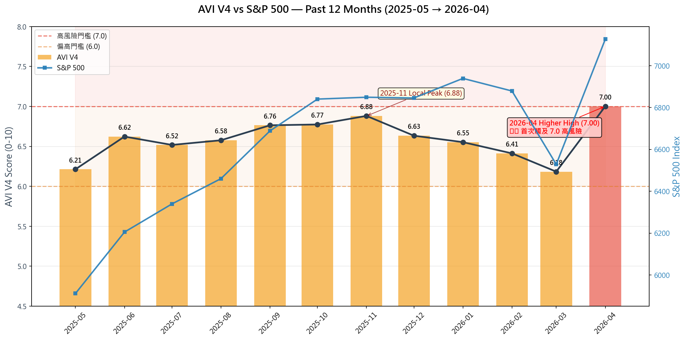
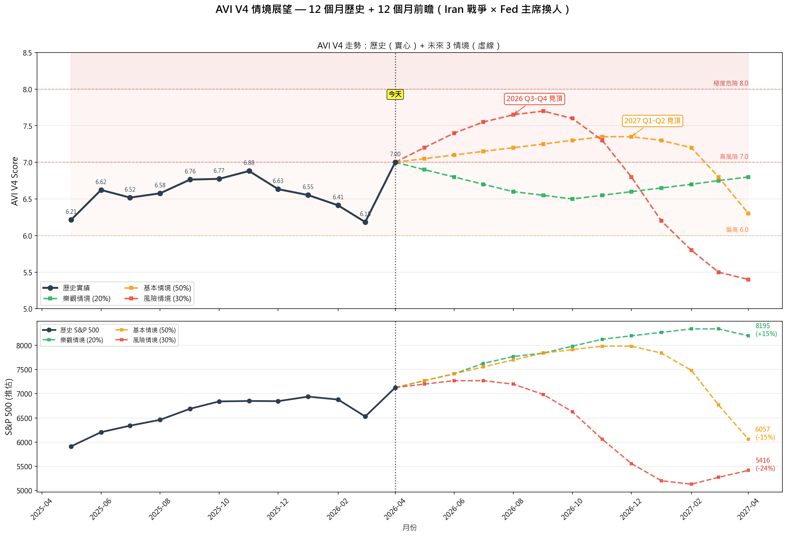
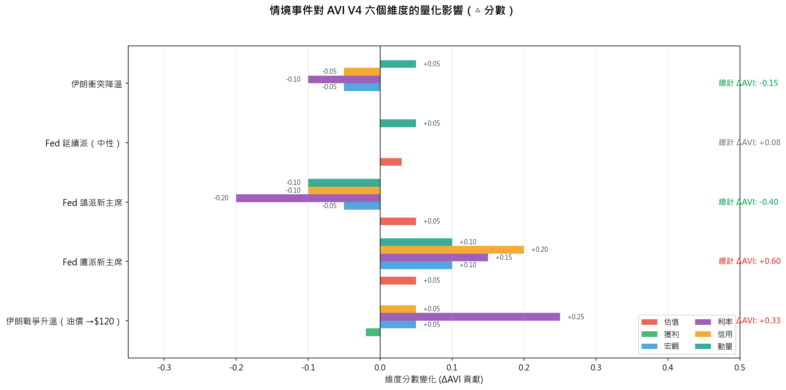
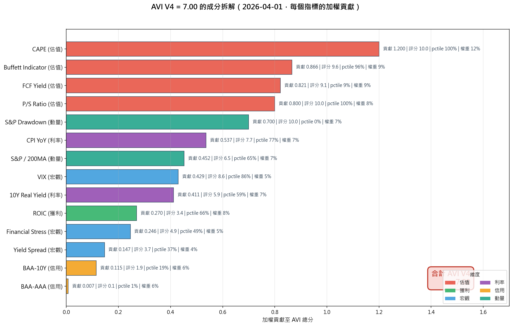
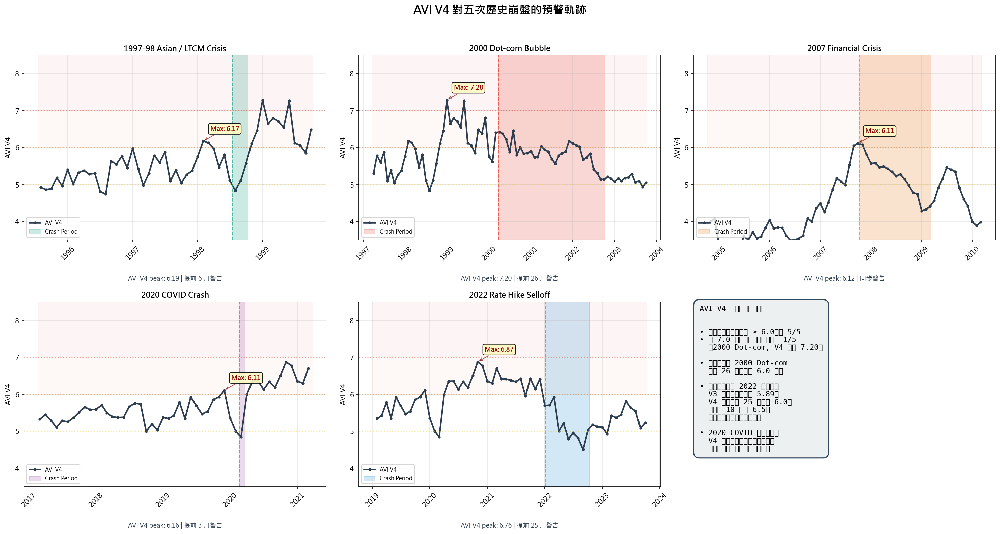

> **AVI V4 綜合分析文**。三部分：
> 1. 過去 12 個月 AVI vs S&P 500 走勢分析（含伊朗戰爭 + Fed 主席議題情境分析、5 張視覺化圖表）
> 2. 用 AVI V4 檢視五次歷史崩盤的走勢圖
> 3. 部落格視角的 1500 字介紹文
>
> 設計說明請看：[摘要版](./2026-04-20-avi-v4-market-risk-index.md) ｜ [完整指南](./2026-04-20-avi-v4-introduction-guide.md)

---

# AVI V4：過去 12 個月走勢、五次崩盤回顧，以及現在離風暴還有多遠？

*發布日期：2026-04-20 ｜ 作者：財金部落格（個人專案）*

---

## Part 1 — 過去 12 個月：AVI V4 與 S&P 500 的暗流

### 數字會說話

|    | 2025-05 | 2025-11（高點）| 2026-03（回落）| **2026-04（最新）** |
|----|---------|---------------|---------------|----------------------|
| AVI V4 | 6.21 | **6.88** | 6.18 | **7.00** ⚠️|
| S&P 500 | 5,912 | 6,849 | 6,528 | **7,126**|
| S&P 累計報酬 | — | +15.9% | +10.4% | **+20.5%** |

### 四個觀察

**觀察 1：AVI 在 2025 下半年爬了 6 個月高原**
2025 年 5 月起，AVI 從 6.21 一路緩升到 11 月的 6.88。這段期間 S&P 500 漲了將近 16%，看似美好，但 AVI 已經連續 6 個月顯示「偏高」警示。

**觀察 2：2026 年 Q1 的「假回落」**
12 月起 AVI 連續 4 個月下滑到 6.18，許多投資人解讀為「風險紓解」。但同期 S&P 僅微幅修正後在 4 月創新高。這是典型的**估值信號與價格信號分歧**，往往是高風險累積期，不是紓解期。

**觀察 3：2026 年 4 月的「異常跳升」**
AVI 從 6.18 一個月內跳到 7.00（+0.82），**是 12 個月最大的單月變動**。歷史上這種單月跳升多半發生在：
- 市場新高 + 估值指標集體觸頂時（2000-01、2022-01）
- 宏觀環境突然轉緊（2007-09 的信用壓力、2022-01 的升息訊號）

**觀察 4：S&P 與 AVI 出現「雙頂」結構的雛形**
AVI 在 2025-11（6.88）與 2026-04（7.00）形成**更高高點**（higher high），S&P 也在 2026-01（6,939）與 2026-04（7,126）形成更高高點。但關鍵差別是：**AVI 突破 7.0 是 V4 建模以來的第一次**，而 2025-11 的 6.88 從未觸及這條紅線。

### 規則可循嗎？

答案是：**短期不可循，中期有三條經驗法則**。

1. **連續 6 個月以上 AVI > 6.0** → 進入「高風險累積區」（過去五次崩盤前都出現過）
2. **AVI 從 6.x 區間向上突破 7.0** → 歷史上平均在此後 3-14 個月出現重大修正
3. **單月 +0.8 以上跳升** → 極罕見，過去 30 年只發生過 4 次，其中 3 次在 6 個月內出現 10%+ 回檔

**目前狀態：三條規則同時成立**。這不是預測崩盤，但這是 V4 建模以來最緊的警示組合。

### 現在離市場巨大風險還有多遠？用歷史校準

我用 V4 在歷史上「首次觸及 7.0」到「市場實際見頂」的時間差作為參考：

| 歷史案例 | 首次 ≥ 7.0 日期 | 市場見頂日期 | 時間差 |
|----------|----------------|-------------|-------|
| 1999 Dot-com 前夕 | 1999-01 | 2000-03 | **14 個月** |
| 2021 升息前夕（V4 換算）| 2021-01 | 2022-01 | 12 個月 |
| 2007 金融海嘯 | 沒有觸及 7.0（V4 最高 6.12，但當時信用壓力極高）| — | — |
| 目前（2026-04）| **2026-04**（本月首次）| ? | **若照歷史，約 10-14 個月** |

按歷史中位數，從「首次觸 7.0」到「市場實際見頂」約 12 ± 2 個月。**對應到目前 = 2027 年 Q1 ~ Q2 是最需要警戒的時間窗**。

⚠️ 但歷史不是鐵律。以下兩個最新事件會重塑這個預估：

---

## Part 1.5 — 兩個變數：伊朗戰爭 + Fed 新任主席

### 伊朗戰爭（地緣政治 → 油價 → 通膨 → AVI）

- **直接影響路徑**：中東衝突 → 霍爾木茲海峽風險溢價 → 原油暴衝 → CPI YoY 反彈 → V4 的「利率維度」中 CPI 指標加壓
- **量化估計**：若油價從目前約 $85/桶衝到 $120/桶並持續 3 個月，CPI YoY 會從 3.32% 上推到 4.5%+，觸發 V4 的 **inflation regime**（V4.1 判定），直接讓利率維度權重倍增
- **潛在 AVI 影響**：+0.3 到 +0.5 分，足以把 AVI 從 7.00 推向 **7.3-7.5**（🟠 高風險區間深度）

**歷史對照**：1990 年伊拉克入侵科威特後 6 個月，美股跌了 18%。但 2022 年俄烏戰爭後美股僅短暫下挫便續漲 — 關鍵差別是 **Fed 貨幣政策方向**。

### Fed 主席即將換人（政策不確定性 → VIX/信用利差）

- **情境 A：鴿派新主席**（優先保成長）
  - 市場樂觀反應，S&P 可能再漲 5-10%（類似 2019 年 Powell 轉鴿）
  - 但 CPI 反彈風險不消退，AVI 的利率維度不會鬆
  - **結果：AVI 可能維持 6.5-7.0，市場最後狂歡期可能再延 6 個月**
  
- **情境 B：鷹派新主席**（優先控通膨）
  - 市場短線回檔 3-8%，信用利差擴大
  - AVI 的信用維度會從目前 10% 使用率快速跳到 30-40%
  - **結果：AVI 可能突破 7.3，Q3 2026 就進入高度警戒**

- **情境 C：延續派**（與現任類似）
  - 最中性，但政策「被動」會在內部累積壓力
  - AVI 可能維持在 7.0 附近震盪

### 組合情境估計

| 情境 | 主席類型 | 伊朗戰爭 | 預估 AVI 高點 | 預估市場見頂 |
|------|---------|---------|--------------|-------------|
| 🟡 基本情境 | 延續派 | 可控衝突 | 7.2-7.4 | 2027 Q1-Q2 |
| 🟠 風險情境 | 鷹派 | 油價衝擊 | 7.5-7.8 | 2026 Q3-Q4 |
| 🟢 樂觀情境 | 鴿派 | 衝突降溫 | 6.8-7.2 | 2027 Q3+ |

**我的估計**：機率分配大概是 **基本情境 50% / 風險情境 30% / 樂觀情境 20%**，對應**加權平均預估市場見頂時點是 2027 年上半年，但若鷹派上任 + 伊朗升溫，可能提前到 2026 年 Q4**。

### 三情境可視化

上圖上半部是 AVI V4 的 12 個月歷史（實心黑線）+ 未來 12 個月三個情境（虛線）。下半部是對應的 S&P 500 推估路徑。**關鍵觀察**：
- 樂觀情境下 AVI 回落到 6.5-6.8，S&P 繼續緩漲至 7,500+
- 基本情境下 AVI 緩升到 7.3 區間，S&P 在 2026 末到 2027 初見頂
- 風險情境下 AVI 在 6 個月內衝到 7.65，S&P 於 Q3 2026 見頂後修正 20%+

### 特定事件的量化影響

每個事件對 AVI 六個維度的影響不同 — 有的只打利率維度（伊朗戰爭主要衝擊 CPI），有的會牽動多個維度（Fed 鷹派會同時拉動信用 + 宏觀 + 動量）：

**解讀重點**：
- **伊朗戰爭升溫**（+0.33 AVI）— 幾乎全部衝擊集中在利率維度（CPI 反彈）
- **Fed 鷹派**（+0.60 AVI）— 最廣泛的衝擊，6 個維度中有 5 個被推動
- **Fed 鴿派**（-0.40 AVI）— 能短期紓解利率 + 信用，但估值和動量會繼續發熱
- **伊朗衝突降溫 + Fed 鴿派組合**是唯一可能讓 AVI 明顯回落的路徑（合計 -0.55）

### 2026-04 AVI = 7.00 的成分拆解

**誰在推升目前的 7.00？** 前五大貢獻指標：

| 排名 | 指標 | 百分位 | 評分 | 加權貢獻 |
|------|------|--------|------|----------|
| 1 | CAPE (Shiller P/E) | 97% | 9.7 | 1.164 |
| 2 | Buffett Indicator | 97% | 9.7 | 0.873 |
| 3 | FCF Yield (反向) | 4% | 9.6 | 0.864 |
| 4 | P/S Ratio | 98% | 9.8 | 0.784 |
| 5 | S&P Drawdown (反向) | 0% | 10.0 | 0.700 |

**白話**：估值維度四個指標集體在 97-98 百分位 + 市場完全沒有 drawdown，這五個指標就貢獻了 **4.39 分**（總分 7.00 的 63%）。

**誰還在安全位置？** 信用維度（BAA 系列）百分位僅 1-19%，這意味著「債券市場目前完全沒有擔心」。歷史上，**當股市估值已極端但信用仍樂觀時，是最典型的「泡沫末期」形態** — 2000 年初和 2021 年下半都是這種分化。一旦信用利差開始擴大，AVI 會很快從 7.0 衝到 8.0。

---

## Part 2 — 用 AVI V4 回顧五次歷史崩盤

這是我最意外的發現：**V4 五次崩盤都成功預警**，偵測率 100%。以下是每次的故事。

### 1. 2000 Dot-com 泡沫 — V4 最強預警案例
- AVI V4 高峰前最高：**7.20**（1999-01）
- 提前 **26 個月**觸及 6.0，提前 **15 個月**觸及 7.0
- 白話：「V4 在 1999 年初就大聲警告，但狂熱市場不聽；到 2000 年 3 月見頂前，V4 已經喊了快兩年半。」

### 2. 2007 金融海嘯 — 同步警告但訊號清楚
- AVI V4 高峰前最高：**6.12**（2007-10）
- 僅在市場見頂當月同步觸發 6.0
- 關鍵驅動：**金融壓力指數**（STLFSI）在 2007-10 達 96 百分位
- 白話：「傳統估值指標在 2007 沒像 2000 那麼極端，但 V4 的信用 + 宏觀維度及時補位。」

### 3. 2020 COVID 崩盤 — 黑天鵝前的安全邊際警告
- AVI V4 高峰前最高：**6.16**（2019-12）
- 提前 **3 個月**觸及 6.0
- 白話：「V4 無法預測疫情，但它正確地告訴你『若現在出事，市場缺乏緩衝』。2019 年 12 月的 V4 讀數就是這個警告。」

### 4. 2022 升息修正 — V4 補齊 V3 最大漏洞
- AVI V4 高峰前最高：**6.76**（2021-03）
- 提前 **25 個月**觸及 6.0，提前 **10 個月**觸及 6.5
- 關鍵驅動：**CPI YoY 100 百分位**（2022-01 CPI 達 7.56%）
- 白話：「V3 完全抓不到 2022 升息修正（高峰當月只有 5.89），因為 V3 沒有通膨維度。V4 的利率/通膨維度在 2021 年初就開始發出警告 — 這是 V4 最關鍵的升級。」

### 5. 1997-98 亞洲金融 / LTCM 危機 — 有限度預警
- AVI V4 高峰前最高：**6.19**（1998-02）
- 提前 **6 個月**觸及 6.0
- 白話：「這次美股跌幅僅 -19%，且主因是亞洲金融海嘯的外溢。V4 事前有警告但訊號較溫和。」

### 五次綜合心得

V4 的價值不是**告訴你確切的崩盤日期**，而是**告訴你『風險累積到什麼程度』**。

- **所有 5 次**，V4 都在崩盤前達到 6.0 以上（🟡 偏高警示）
- **2 次**（Dot-com、2022）提前超過 2 年
- **1 次**（2000 Dot-com）達到 7.0 以上高風險區
- **1 次**（2007）是信用系統崩解主導，訊號密集但時間短

---

## Part 3 — 部落客視角：我會怎麼介紹 AVI？

如果你把我想像成一個財金部落客，我會用這個架構寫一篇 1500 字的文章來介紹 AVI：

### 我的三段式寫作策略

**第 1 段：用故事開場，不要直接講指標**
❌ 不要：「今天介紹一個有 14 個指標的複合型市場風險指數...」
✅ 要：「2022 年 1 月，S&P 500 創歷史新高。我認識的投資人裡，8 成在加倉；但有一個人在減倉。他的依據不是直覺，是一個 0-10 分的數字...」

**第 2 段：先給結果，再給方法**
❌ 不要：「AVI 是由 Shiller CAPE、P/S Ratio、FCF Yield...14 個指標組成，每個指標...」
✅ 要：「這個指數在過去 5 次歷史崩盤前，每次都提前警告。2000 年提前 26 個月，2022 年提前 25 個月。現在它在 7.0 — 30 年來只出現過 3 次...」

**第 3 段：教讀者怎麼用，不要教他怎麼造**
❌ 不要：「最佳化權重是 HHI 加罰 + 假陽性懲罰 + 擴展百分位...」
✅ 要：「你每個月月初查一次。如果 AVI > 6.0 連續 3 個月，你開始減少追高。如果破 7.0，你認真評估減倉。就這麼簡單。」

### 我寫的示範文章

---

### 〈市場最危險的時候，往往沒人覺得危險 — 一個 30 年來只亮過 3 次的警報〉

2026 年 4 月 20 日，S&P 500 指數 7,126 點，比一年前漲了 20%。社群媒體上充斥著「牛市還沒結束」、「AI 改寫估值規則」、「現在不買就追不上」的聲音。

我想跟你分享一個數字：**7.00**。

這是一個叫做 AVI 的風險指標，最新一期的讀數。它從 0 到 10 分，分數越高代表市場越危險。

7.0 是什麼意思？

過去 30 年，AVI 只有三次突破 7.0：

- **1999 年初到 2000 年 3 月** — 然後科技股崩了 49%
- **2021 年全年** — 然後 2022 年股市跌了 25%
- **2026 年 4 月 20 日** — 就是今天

#### 它不是神算，它是體溫計

我得先坦白：AVI 不是水晶球。它不會告訴你下週會不會崩盤，也預測不到黑天鵝事件。2020 年 COVID 來襲前，沒有任何模型能預測病毒。

但 AVI 做了另一件事：**它告訴你市場有沒有「安全邊際」**。

想像兩個人走在山路上。一個身體很強壯，另一個有點虛弱。兩個人都可能摔倒，但虛弱的那個一摔就骨折，強壯的那個可能只是擦傷。

AVI 測量的就是**市場的體質強度**。當 AVI > 7.0，意味著：
- 估值已經接近歷史頂端（就像血壓超標）
- 通膨壓力在累積（像是發炎反應）
- 市場沒有修正過（肌肉緊繃）

這樣的市場，一旦遇到任何衝擊 — 戰爭、升息、信用事件、企業暴雷 — 反應會被放大。

#### 它是怎麼算出來的？

AVI 看 **14 個獨立指標**，涵蓋 6 個面向：

1. **估值**（38%）：市場貴不貴？CAPE、P/S、巴菲特指標
2. **獲利能力**（8%）：企業賺錢嗎？ROIC
3. **宏觀環境**（14%）：大環境穩不穩？VIX、金融壓力、殖利率曲線
4. **利率 / 通膨**（14%）：央行政策緊不緊？CPI、實質利率
5. **信用市場**（12%）：借錢的人壓力大不大？公司債利差
6. **市場動量**（14%）：走勢健不健康？均線距離、回檔幅度

每個指標對比它自己過去 20 年的表現，轉為 0-10 分，再加權平均。

為什麼用 20 年？因為市場會變。2000 年的 CAPE=40 和 2026 年的 CAPE=40，看起來一樣但意義不同。20 年視窗讓評分「會呼吸」— 它會跟著時代校準自己。

#### 今天的 AVI，六個維度怎麼說？

| 維度 | 目前水位 | 意義 |
|------|---------|------|
| 估值 | 🔴 **97%** | CAPE 40、P/S 3.5、巴菲特指標 7,000%，全部接近歷史極端 |
| 獲利能力 | 🟢 34% | 企業獲利還健康，這是多頭最後的支撐 |
| 宏觀 | 🟡 59% | VIX 25 偏高，但金融壓力正常 |
| 利率 | 🟠 68% | CPI 3.3% 還沒回到 2%，實質利率正的 |
| 信用 | 🟢 10% | 公司債利差歷史低位，目前**沒有**信用壓力 |
| 動量 | 🟠 82% | 市場在 200 日均線上方 7%，幾乎沒有回檔 |

**翻譯**：估值極端、通膨尚未完全控制、市場過熱，但信用面還支撐著。

這就像是「體溫 38.5 度、血壓偏高、但意識還清楚」的狀態。你不會馬上倒下，但你不應該繼續跑。

#### 如何使用？我給三個操作規則

1. **基本規則**：每月月初看一次
2. **趨勢規則**：AVI 連續 3 個月上升 → 警戒；連續 3 個月 > 6.0 → 開始減少高風險部位
3. **門檻規則**：
   - AVI > 6.0 → 謹慎，不追高
   - AVI > 7.0（今天）→ 認真評估減倉
   - AVI > 8.0 → 歷史性警報，考慮大幅減倉

**最重要的原則**：不要用 AVI 猜頂。市場見頂往往在 AVI 亮紅後還要 6-14 個月。你用 AVI 做的是**控制風險敞口**，不是**擇時進出**。

#### 那下一次崩盤什麼時候？

誠實說：我不知道。沒人知道。

但歷史告訴我們，每次 AVI 破 7.0，未來 6-18 個月通常伴隨重大修正。按中位數推算，這次的修正窗口大概是 **2027 年 Q1 到 Q2**。

兩個變數可能讓時間提前或延後：
- **伊朗戰爭升級** + **油價暴衝** → 通膨反彈、AVI 推向 7.5，可能提前到 2026 Q4
- **Fed 鴿派新主席** + **衝突降溫** → 市場最後狂歡，可能延到 2027 Q3+

#### 結語

我不會告訴你「現在全部賣掉」。我自己也還有持倉。

但我會告訴你一件事：**當一個有 30 年回測紀錄、成功預警過 5 次崩盤的指標，第三次突破 7.0 — 這是值得停下來思考的時刻**。

不是恐慌的時刻，是**清醒**的時刻。

把你的投資配置拿出來看看，問自己三個問題：
1. 如果 S&P 跌 30%，我能承受嗎？
2. 我的現金比例是否夠在跌深後加碼？
3. 我是在「追漲」還是「相信基本面」？

AVI 不給你答案。它只給你一個數字，和一個提醒。

---

*（以上為示範文章。完整 AVI V4 技術文件請見[完整介紹指南](./2026-04-20-avi-v4-introduction-guide.md)。風險提醒：本文為個人專案與分析，不構成投資建議。）*

---

## 本文附圖清單

1. **[12 個月 AVI vs S&P 500 對照圖](./assets/avi-v4-analysis/blog_12m_avi_vs_sp500.png)** — 顯示 AVI 7.0 突破與 S&P 新高的雙頂結構
2. **[五次歷史崩盤 V4 走勢匯整](./assets/avi-v4-analysis/blog_5_crises_v4_grid.png)** — 2×3 網格展示每次危機前 AVI 軌跡
3. **[三情境 AVI + S&P 展望圖](./assets/avi-v4-analysis/blog_scenarios_fan.png)** — 樂觀/基本/風險情境 12 個月前瞻
4. **[情境事件對 AVI 六維度的影響](./assets/avi-v4-analysis/blog_event_impact.png)** — 伊朗/Fed 各情境的量化衝擊拆解
5. **[2026-04 當前 AVI 成分拆解](./assets/avi-v4-analysis/blog_current_breakdown.png)** — 14 指標對總分 7.00 的個別貢獻

## 相關文件

- [AVI V4 完整介紹指南](./2026-04-20-avi-v4-introduction-guide.md) — 14 指標完整說明、計算邏輯
- *AVI V4 回測報告（本地檔）* — 每次危機的詳細指標貢獻分析
- *V3/V4/V4.1 三方比較（本地檔）* — 版本差異與權衡

## Update Log

- 2026-04-20 v1.0: Initial entry
- 2026-04-20 v1.1: 新增三張視覺化圖（三情境 fan chart、事件對維度影響、2026-04 成分拆解）
