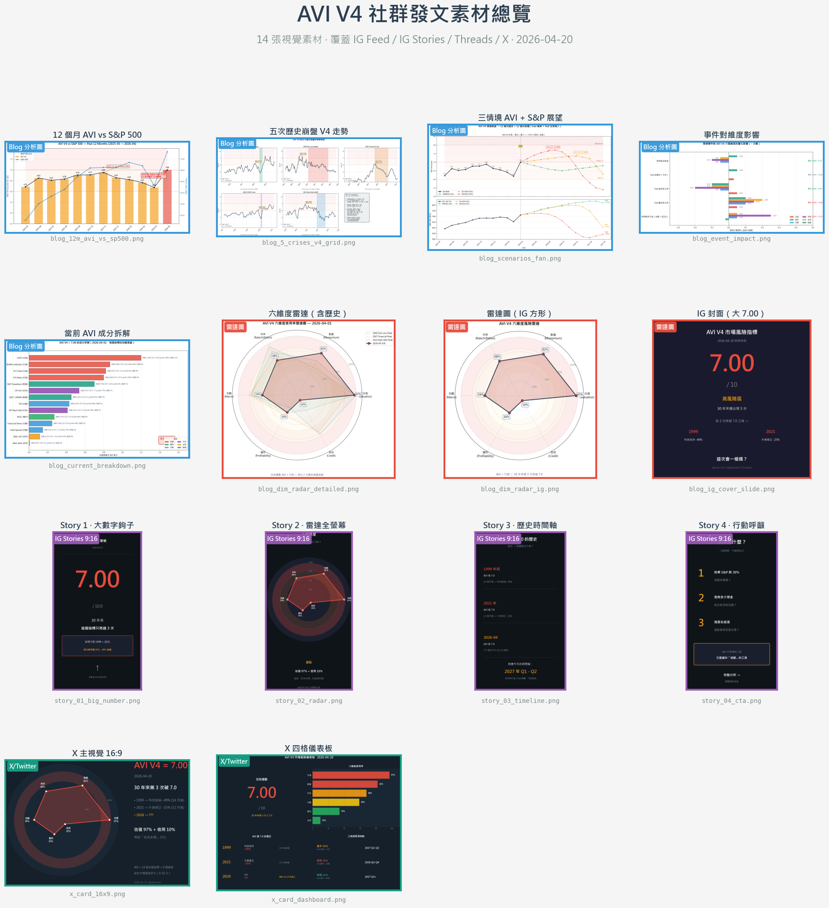
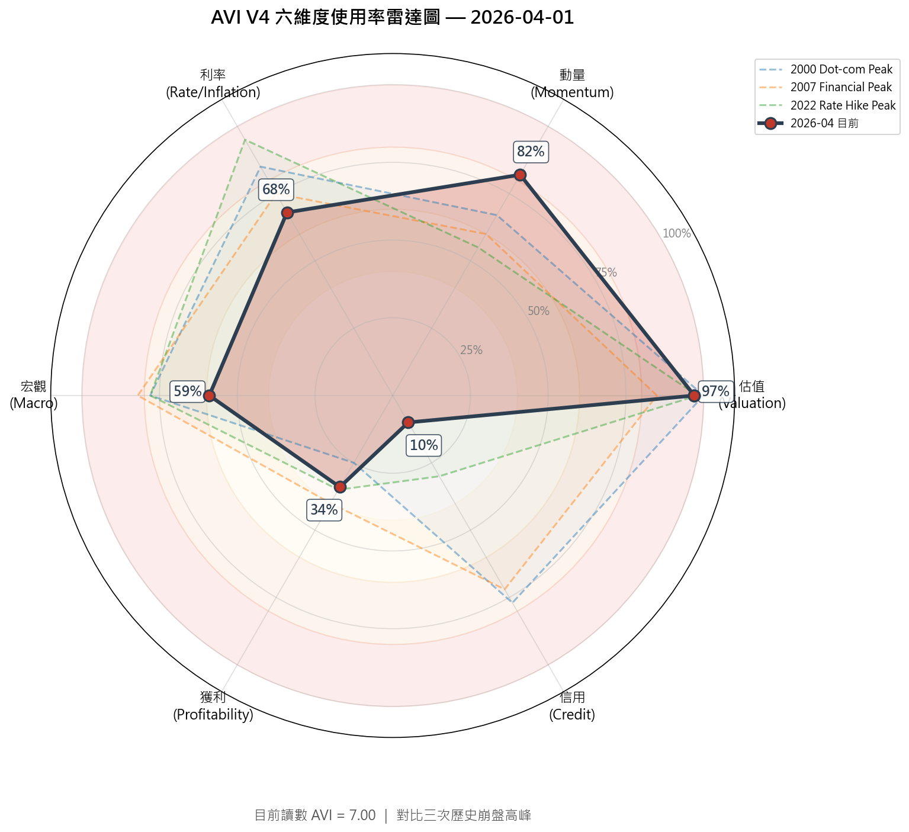
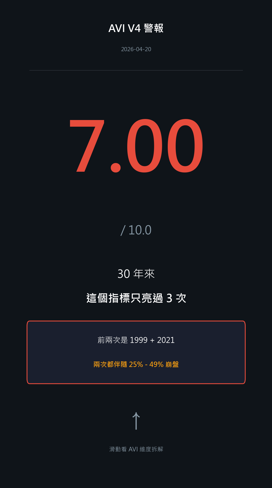
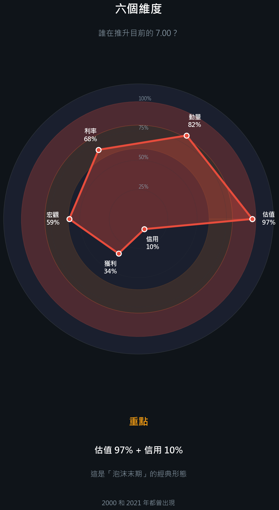
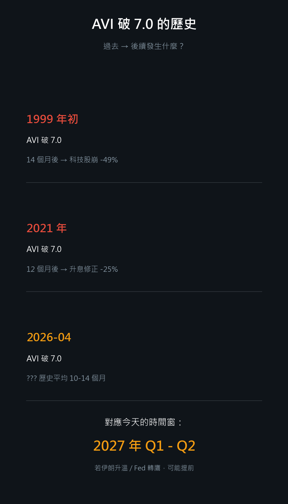
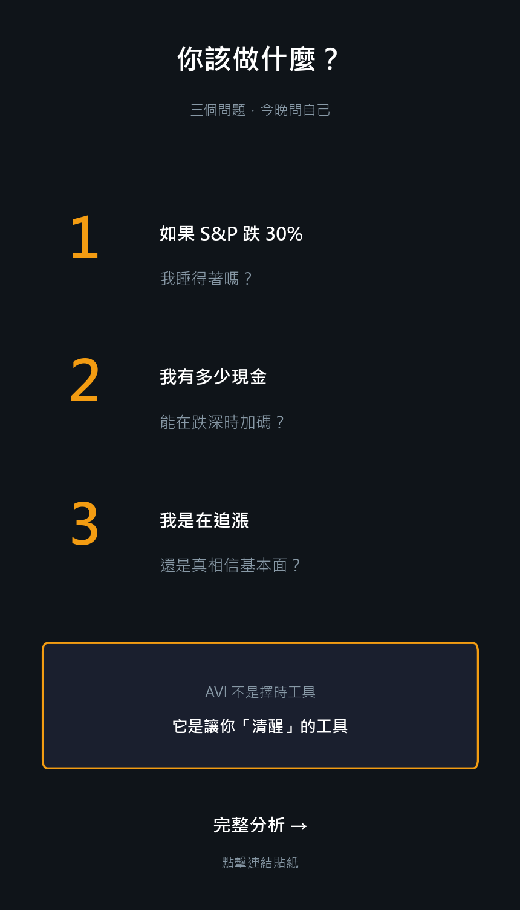

> **AVI V4 社群發文完整素材**：IG Carousel 6 張設計 + 主 Caption + Threads 10 則串文 + 發文時程建議。內容均可直接複製使用。

---

## 📦 一鍵下載素材包

- **[📥 下載 ZIP 完整素材包（2.8 MB）](./assets/avi-v4-analysis/AVI_V4_Social_Kit.zip)** — 14 張素材圖 + 4 份 MD 文件 + 總覽縮圖 + 排程 XLSX
- **[📅 發文行事曆 XLSX](./assets/avi-v4-analysis/AVI_V4_Posting_Schedule.xlsx)** — 7 天排程 + KPI 目標
- **[🖼️ 素材總覽縮圖](./assets/avi-v4-analysis/AVI_V4_Asset_Overview.png)** — 14 張素材一覽（4×4 網格）



---
# AVI V4 社群發文素材庫

*2026-04-20 ｜ 依 IG + Threads 優化格式設計*

---

## 📸 Instagram 發文（Carousel 建議 6 張）

### 封面設計建議

**Slide 1（封面）**：使用 `blog_ig_cover_slide.png`
- 深色背景 + 大數字 `7.00`
- 「30 年來第 3 次突破 7.0」作為鉤子
- 前兩次：1999 → 科技泡沫 -49%、2021 → 升息修正 -25%

**Slide 2（雷達圖）**：使用 `blog_dim_radar_ig.png`
- 六維度風險分佈一目了然
- 視覺上直接看出「估值、動量吃滿」vs「信用、獲利還低」

**Slide 3（歷史五次崩盤）**：使用 `blog_5_crises_v4_grid.png` 的裁切版
- 展示過去 5 次崩盤前 AVI 都 ≥ 6.0
- 建立「可信度」

**Slide 4（12 個月走勢 + S&P 對照）**：使用 `blog_12m_avi_vs_sp500.png`
- 展示 2026-04 是「新高雙頂」
- 重點標註 AVI 單月 +0.82 的跳升

**Slide 5（三情境展望）**：使用 `blog_scenarios_fan.png`
- 基本情境 2027 Q1-Q2 見頂
- 風險情境 2026 Q3-Q4 見頂
- 給讀者一個時間錨點

**Slide 6（行動建議）**：用文字卡片
- 「AVI > 6.0 三個月 → 警戒」
- 「AVI > 7.0 → 認真評估減倉」
- 「但別用 AVI 擇時，用它控制敞口」
- 結尾 CTA：「你現在的現金比例是？留言告訴我」

---

### Caption（主文案）

```
30 年來，這個指標只亮過 3 次 🔴

第 1 次：1999 年初 → 科技股崩盤 -49%
第 2 次：2021 年全年 → 2022 升息修正 -25%
第 3 次：2026 年 4 月 20 日 ← 就是今天

它不是水晶球，也預測不到黑天鵝。
它做的事很簡單：
告訴你市場有沒有「安全邊際」

這個指標叫 AVI
綜合 14 個財金指標跨越 6 個維度：
• 估值（CAPE, P/S, 巴菲特指標）
• 獲利能力（ROIC）
• 宏觀環境（VIX, 殖利率曲線）
• 利率/通膨（CPI, 實質利率）
• 信用市場（公司債利差）
• 市場動量（200MA, 回檔深度）

每個指標比對自己過去 20 年的表現
轉成 0-10 分再加權平均

今天的分數是 7.00

估值吃滿 97%
動量吃到 82%
但信用市場還在 10% 的超樂觀狀態

這種分化結構，
2000 年初出現過
2021 年下半出現過
現在又出現了

.
.
.

我不會叫你全部賣掉（我自己也還有倉）
但我會告訴你：

這是一個值得「停下來思考」的時刻
不是恐慌，是清醒

問自己三個問題：
1️⃣ 如果 S&P 跌 30%，我睡得著嗎？
2️⃣ 我有足夠現金，能在跌深時加碼嗎？
3️⃣ 我是在「追漲」，還是「相信基本面」？

留言 💬 告訴我你的現金比例！

#美股 #投資 #風險管理 #CAPE #巴菲特指標
#AVI #金融指標 #個人理財 #投資策略
```

---

## 🧵 Threads 串文（10 則接力）

Threads 的演算法偏好**連續發文形成討論串**。以下是建議的 10 則串文設計：

---

### Thread 1/10（開場鉤子）

```
2026-04-20。

S&P 500 站上 7,126 點，創歷史新高。
社群媒體充斥著「牛市沒結束」、「AI 改寫規則」的聲音。

我想分享一個數字：**7.00**

這是一個 30 年來只亮過 3 次的警報。

下一則，我告訴你為什麼這很重要 👇
```

---

### Thread 2/10（歷史對照）

```
前兩次這個警報亮起：

🔴 1999 年初 → 科技股崩盤 -49%
🔴 2021 年全年 → 2022 升息修正 -25%

今天是第三次。

但先聲明：這不是水晶球。
它不會告訴你下週會不會崩。
它做的是另一件事 ⬇️
```

---

### Thread 3/10（AVI 是什麼）

```
這個警報叫 AVI（Adjusted Valuation Index）

用人話說：
它像市場的「體溫計」

把 14 個金融指標整合成一個 0-10 分的分數
分數越高 = 市場越危險

當前 7.00 = 「體溫偏高，需要留意」
破 8.0 才是「發燒該就醫」（歷史上只發生過一次，2000 年 1 月）
```

---

### Thread 4/10（為什麼需要這種綜合指標）

```
有人問我：為什麼不直接看 CAPE 或 VIX？

因為單一指標容易被騙。

2021 年：CAPE 38（極高）但 VIX 只有 15（低）
2008 年：CAPE 27（中等）但金融壓力指數 96% pctile

**每次崩盤的「主角」都不一樣**
所以 AVI 同時看 14 個指標
任何一個極端都會拉高總分
```

---

### Thread 5/10（今天的成分拆解）

```
今天 AVI = 7.00，誰在推升它？

估值維度 97% 吃滿（CAPE 40、P/S 3.5、巴菲特指標 7,000%）
動量維度 82%（S&P 在 200 日均線上方 7%，無回檔）
利率維度 68%（CPI 還沒回 2%，實質利率轉正）

👉 前 5 個指標合計 4.39 分 = 占總分 63%

但信用維度只有 10% ⚠️
```

---

### Thread 6/10（分化結構的意義）

```
為什麼信用維度低 = 更警惕，不是更安心？

因為「估值已極端 + 信用仍樂觀」
是典型的**泡沫末期**形態

2000 年初：估值爆表、信用利差壓到歷史低位 → 3 個月後崩
2021 年底：估值爆表、信用利差壓到歷史低位 → 1 個月後崩

當股市最貴、債市最樂觀時
是**最危險的組合**

而不是「有一個指標還低就沒事」
```

---

### Thread 7/10（12 個月走勢解讀）

```
過去 12 個月 AVI V4 軌跡：

2025-05: 6.21
2025-11: 6.88（本地高）
2026-03: 6.18（回落）
2026-04: **7.00（+0.82 單月跳升）** ← 就是昨天

+0.82 是 12 個月最大變動
30 年來這種跳升只發生過 4 次
其中 3 次在 6 個月內出現 10%+ 回檔
```

---

### Thread 8/10（時間預估）

```
AVI 破 7.0 → 市場實際見頂的時間差：

歷史校準：
• 1999 → 2000：14 個月
• 2021 → 2022：12 個月

中位數 12 ± 2 個月

對應今天，預估見頂窗口：
**2027 年 Q1 - Q2**

但兩個變數可能讓時間提前：
1️⃣ 伊朗戰爭升溫 → 油價衝擊 → CPI 反彈
2️⃣ Fed 鷹派新主席 → 信用利差擴張
```

---

### Thread 9/10（三情境機率分配）

```
我的情境機率估計：

🟡 基本情境（50%）
Fed 延續派 + 伊朗可控
→ AVI 升到 7.3，2027 Q1-Q2 見頂

🟠 風險情境（30%）
Fed 鷹派 + 油價衝擊
→ AVI 衝到 7.7，2026 Q3-Q4 見頂

🟢 樂觀情境（20%）
Fed 鴿派 + 衝突降溫
→ AVI 回落到 6.5-6.8，延後到 2027 Q3+

期望值見頂時點：2026 Q4 - 2027 Q2
```

---

### Thread 10/10（行動建議 + CTA）

```
我不會叫你「現在全部賣掉」。

但我會告訴你：
過去兩次 AVI 破 7.0，最後都跌了 25-49%

問自己 3 個問題：

1️⃣ 跌 30% 我睡得著嗎？
2️⃣ 我現金夠跌深加碼嗎？
3️⃣ 我在追漲，還是真相信基本面？

AVI 的工作不是叫你擇時
是讓你**清醒**

留言告訴我你現在的股票：現金比例 👇

---
完整 14 指標的邏輯 + 5 次崩盤回測
都寫在這篇部落格文章：[連結]
```

---

## 📱 Threads 發文時程建議

| 時間 | 發文類型 |
|------|---------|
| Day 1 09:00 | Thread 1-3（開場 + 歷史 + 定義） |
| Day 1 21:00 | Thread 4-6（為何綜合 + 當前拆解 + 分化警訊） |
| Day 2 09:00 | Thread 7-8（12M 走勢 + 時間預估） |
| Day 2 21:00 | Thread 9-10（三情境 + CTA） |

**為什麼拆兩天發？**
- 單日 10 則會洗到讀者粉絲首頁，反而降低觸及
- 拆 4 波可以讓每則都有獨立點擊/留言
- 隔天重新引流，第二波讀者會倒回去看第一波

**互動設計**：
- Thread 5（成分拆解）最容易引發「原來如此」的討論 → 發文時多留 2 小時專心回覆
- Thread 10 的 CTA 問題（現金比例）是引流核心，回覆時可以提 blog 連結

---

## 🎨 視覺素材清單（所有圖已產出）

| 檔名 | 用途 | 格式 |
|------|------|------|
| `blog_ig_cover_slide.png` | IG Slide 1 封面 | 9:9 方形，深色背景 |
| `blog_dim_radar_ig.png` | IG Slide 2 雷達圖 | 9:9 方形，乾淨版 |
| `blog_dim_radar_detailed.png` | 詳細版雷達（+歷史對照）| 12:10，適合部落格 |
| `blog_5_crises_v4_grid.png` | IG Slide 3 五次崩盤 | 20:11 長條，裁切使用 |
| `blog_12m_avi_vs_sp500.png` | IG Slide 4 + Threads 配圖 | 14:7 |
| `blog_scenarios_fan.png` | IG Slide 5 三情境 | 16:11 |
| `blog_event_impact.png` | 進階內容配圖 | 14:7 |
| `blog_current_breakdown.png` | 進階內容配圖 | 14:9 |

---

## 📊 六維度雷達圖 — 完整版



- 紅色實心粗線 = 2026-04 目前讀數
- 虛線 = 2000 / 2007 / 2022 三次歷史崩盤高峰對照
- 外圈紅色區塊 = ≥ 80% 高風險區，橙色 = 60-80%

**解讀**：
- 目前的「形狀」和 **2022 升息修正**高度相似（估值高 + 利率壓力 + 動量過熱 + 信用低）
- 和 **2000 Dot-com** 也很像，但信用維度（目前 10%）比 2000 當時（77%）更低 — 這是分化更極端的訊號

---

## 💡 發文前的最後檢查清單

- [ ] 所有圖片都已壓縮到 IG 上傳限制（<30MB）
- [ ] Caption 有 5-9 個相關 hashtag（不過量）
- [ ] Threads 每則 ≤ 500 字元，留字數給互動
- [ ] 第一則 Threads 前 1 小時多留意回覆，有助演算法推送
- [ ] IG carousel 建議發表時間：台灣時間晚間 8-10 點
- [ ] Threads 建議時間：早上 9 點 / 晚上 9 點

---

*完整分析文件：[分析文章（KIWI）](./2026-04-20-avi-v4-analysis-with-charts.md)*
*完整技術指南：[完整指南（KIWI）](./2026-04-20-avi-v4-introduction-guide.md)*


---

# v2 擴充：X/Twitter + IG Stories

**1/12** 📊
```
2026-04-20，S&P 500 創新高 7,126。
社群一片樂觀。

但一個叫 AVI 的指標剛破 7.00 —
30 年來只出現過 3 次的警報。

前兩次是 1999 和 2021。
後面分別跌了 49% 和 25%。

這篇說明它是什麼、為什麼重要。🧵
```
**[附圖：x_card_16x9.png]**

---

**2/12**
```
先消除誤會：
AVI 不是水晶球，預測不到黑天鵝。

它是「體溫計」—
告訴你市場體質強不強、
有沒有安全邊際。

體溫 38.5 不代表今晚昏迷，
但你不該繼續跑步。

AVI 目前就是 38.5。
```

---

**3/12**
```
怎麼算？

14 個獨立指標 × 6 個維度：
• 估值（CAPE, P/S, Buffett）
• 獲利（ROIC）
• 宏觀（VIX, Yield Spread）
• 利率（CPI, 實質利率）
• 信用（公司債利差）
• 動量（200MA, Drawdown）

每指標對比自己過去 20 年 → 0-10 分
加權平均 → 最終 AVI
```

---

**4/12**
```
為什麼要 14 個？單看 CAPE 不行嗎？

因為每次崩盤的「主角」都不一樣。

2000：CAPE 43（極高）主導
2008：CAPE 27（中等），但金融壓力爆表
2022：CAPE 37（高），但真正的推手是 CPI 7%+

AVI 同時監控所有方向。
任何一個極端都會拉高總分。
```

---

**5/12** 📊
```
今天 7.00，誰在推？

估值 97% 吃滿
（CAPE 40、P/S 3.5、Buffett 7000%）

動量 82% 過熱
（S&P 在 200MA 上 7%，無 drawdown）

利率 68% 壓力中
（CPI 3.3%、實質利率 +0.93%）

但信用只有 10%
⚠️ 這是關鍵異常
```
**[附圖：x_card_dashboard.png]**

---

**6/12**
```
為什麼信用低 = 更警戒？

「估值高 + 信用樂觀」是泡沫末期經典分化：

2000-01：估值爆表、公司債利差壓到歷史低 → 3 個月崩
2021-12：估值爆表、利差同樣壓低 → 1 個月崩

當最貴的股市遇上最樂觀的債市，
是**最危險的組合**，不是最安心的組合。
```

---

**7/12**
```
過去 12 個月 AVI 軌跡：

2025-05：6.21
2025-11：6.88（本地高）
2026-03：6.18（回落）
2026-04：7.00（單月 +0.82 跳升）⚡

+0.82 是 12 月最大變動。
30 年這種跳升只發生過 4 次。
其中 3 次，6 個月內股市跌 10%+。
```

---

**8/12** 📊
```
從 AVI 破 7.0 → 市場實際見頂：

1999 → 2000：14 個月
2021 → 2022：12 個月
中位數：12 ± 2 個月

對應今天：
⏰ 2027 年 Q1 - Q2

但兩個變數可能加速：
• 伊朗戰爭 → 油價衝擊
• Fed 鷹派新主席 → 信用崩盤
```
**[附圖：blog_scenarios_fan.png]**

---

**9/12**
```
我的三情境機率分配：

🟡 基本 50%：Fed 延續 + 伊朗可控
   → AVI 升到 7.3，2027 Q1-Q2 見頂

🟠 風險 30%：Fed 鷹派 + 油價衝擊
   → AVI 衝到 7.7，2026 Q3-Q4 見頂

🟢 樂觀 20%：Fed 鴿派 + 衝突降溫
   → AVI 回落 6.5-6.8，延到 2027 Q3+
```

---

**10/12**
```
所以現在該做什麼？

先申明：我不叫你全賣。
我自己也還有倉。

但當 30 年只亮過 3 次的警報再度響起，
這是「停下來」的時刻，
不是「恐慌」的時刻。
```

---

**11/12**
```
三個問題，今晚問自己：

1️⃣ 如果 S&P 跌 30%，我睡得著嗎？
2️⃣ 我現金多少、能跌深加碼嗎？
3️⃣ 我在追漲，還是真信基本面？

AVI 的工作不是擇時，
是讓你**清醒**。
```

---

**12/12**
```
完整 14 指標的計算邏輯
+ 五次歷史崩盤 V4 回測
+ 三情境量化分析

寫在這篇：
🔗 [KIWI 連結]

Repost 讓更多人看到這個 30 年只亮 3 次的信號 🔄
```

---

### X 發文策略

- **單則 Premium 版**：一次爆擊，適合深度讀者
- **12 則 Thread**：演算法友善，每則都能獨立吸引新讀者
- **發文時間**：美股開盤前 30 分鐘（台灣 21:00）或收盤後（台灣 05:00 轉發）
- **Hashtag**：主串文只在最後一則用 hashtag（避免稀釋演算法）
- **互動設計**：第 11 則的三個問題可釘一則回覆問「你選哪一個？」

---

## 📸 IG Stories 系列（9:16，4 張）

IG Stories 是一次性 24 小時內容，目標是**「鉤上去 → 跳到 blog」**。

### Story 1 — Big Number Hook（大數字鉤子）


**視覺設計**：深色背景 + 巨大紅色「7.00」+ 歷史對照框
**互動設計**：加入「滑動」動畫貼紙，指向下一張

**文字（如果要加 sticker 覆蓋上去）**：
- 貼紙 1：投票貼紙「你覺得會崩嗎？」選項「會」vs「不會」
- 貼紙 2：倒數貼紙「距離我的市場總結 Story 還有 X 小時」

---

### Story 2 — Radar Chart（雷達圖）


**視覺設計**：深色背景，雷達圖填滿中間，底部紅字重點
**互動設計**：
- 貼紙：問題貼紙「你覺得哪個維度最危險？」
- 提示：用手指點螢幕上不同維度的文字（互動暗示）

**文字補充**（可放在背景）：
```
估值 97% = 市場貴爆
動量 82% = 沒回檔過
信用 10% = 完全無警覺
⬆ 這個分化才是警告
```

---

### Story 3 — Historical Timeline（歷史時間軸）


**視覺設計**：三條歷史事件時間軸 + 未來窗口標註
**互動設計**：
- 貼紙：滑動投票「你認為下次見頂會在？」
  - 2026 Q4 / 2027 H1 / 2027 H2+ / 不會崩
- 連結貼紙（關鍵）：指向 KIWI blog URL

---

### Story 4 — CTA（行動呼籲）


**視覺設計**：三個大數字問題 + 黃色提示框
**互動設計**：
- 貼紙：問題貼紙「跌 30% 你最擔心什麼？」開放回答
- 連結貼紙：「完整分析」→ KIWI blog
- 提及貼紙：@tag 相關財經帳號，增加觸及

---

### IG Stories 發布順序 + 時間建議

**最佳發文組合**：Day 1 依序發 Story 1 → 2 → 3 → 4，每張間隔 30 分鐘

| 順序 | Story | 時間（台灣時間）| 目標 |
|------|-------|----------------|------|
| 1 | Big Number | 21:00 | 鉤子、引發好奇 |
| 2 | Radar | 21:30 | 教育、建立專業感 |
| 3 | Timeline | 22:00 | 比喻具象化、提供時間錨點 |
| 4 | CTA | 22:30 | 轉換成 blog 點擊 |

**事後精華**：
- 第 24 小時結束前，把 Story 1（最強視覺）存為「限時動態精華」放在個人檔案
- 精華標題：「AVI 警報」

---

## 📊 各平台素材對照

| 素材 | IG Feed Carousel | IG Stories | Threads | X/Twitter |
|------|-----------------|-----------|---------|-----------|
| `blog_ig_cover_slide.png` | Slide 1 ✅ | ❌（太方）| ❌ | ❌ |
| `blog_dim_radar_ig.png` | Slide 2 ✅ | ❌（太方）| 可以 | 可以 |
| `blog_dim_radar_detailed.png` | ❌（太寬）| ❌ | 🔗 可 | 🔗 可 |
| `blog_12m_avi_vs_sp500.png` | Slide 4 ✅ | ❌ | ✅ | ✅ |
| `blog_5_crises_v4_grid.png` | Slide 3 ✅ | ❌ | ✅ | ✅ |
| `blog_scenarios_fan.png` | Slide 5 ✅ | ❌ | ✅ | ✅ Thread #8 |
| `blog_event_impact.png` | 進階選用 | ❌ | ✅ | ✅ |
| `blog_current_breakdown.png` | ❌（太細）| ❌ | 🔗 可 | 🔗 可 |
| `story_01_big_number.png` | ❌ | ✅ | ❌ | ❌ |
| `story_02_radar.png` | ❌ | ✅ | ❌ | ❌ |
| `story_03_timeline.png` | ❌ | ✅ | ❌ | ❌ |
| `story_04_cta.png` | ❌ | ✅ | ❌ | ❌ |
| `x_card_16x9.png` | ❌ | ❌ | ✅ 可 | ✅ 主視覺 |
| `x_card_dashboard.png` | ❌ | ❌ | ✅ 可 | ✅ Thread #5 |

---

## 🧩 總體發文節奏建議

**Day 1（發布日）**
- 09:00 X Thread 開跑（12 則）
- 12:00 Threads 第一波（1-3 則）
- 21:00 IG Carousel + IG Stories 1-4
- 21:00 Threads 第二波（4-6 則）

**Day 2**
- 09:00 Threads 第三波（7-8 則）
- 21:00 Threads 第四波（9-10 則）
- 當日 IG Stories 過期前，設精華

**Day 3-7**
- 根據 Day 1-2 表現決定是否補發「回應高讚留言」式 follow-up 貼文
- 重點回覆 X Thread 第 11 則底下的互動留言

**週末（Day 5-6）**
- 把全部內容重新整理為一篇 blog post 發 Medium / 部落格
- 連結回 KIWI 主條目

---

*Visual assets 位置：`reports_v4/` 內所有 `blog_*.png`、`story_*.png`、`x_card_*.png`*

## Update Log

- 2026-04-20 v1.0: Initial entry — IG Carousel 6 slides、主 caption、Threads 10 則串文
- 2026-04-20 v2.0: 擴充 X/Twitter 12 則 Thread（+ Premium 單則長文版）、IG Stories 4 張（9:16）、多平台素材對照表
- 2026-04-20 v2.1: 新增 ZIP 打包 + 素材總覽縮圖 + 發文行事曆 XLSX（可下載）
