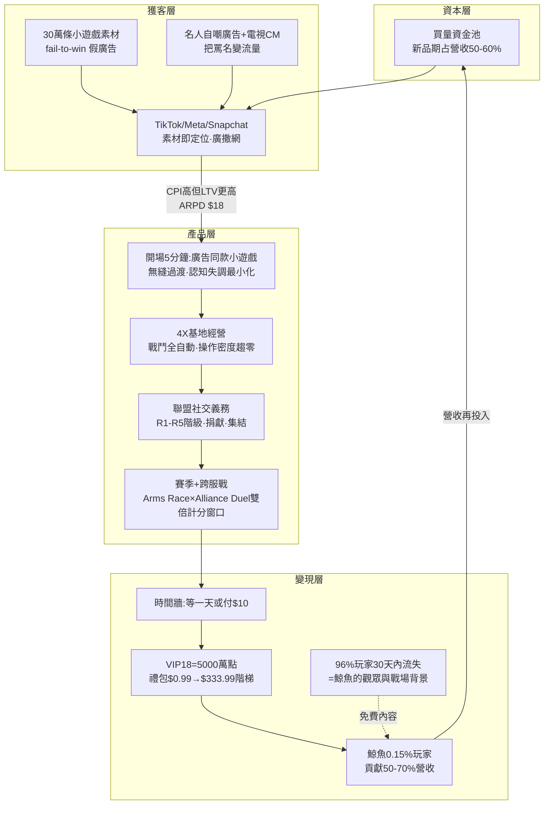

# Last War: Survival 商業模式全解剖

> **研究方法與證據等級（先讀這段再引用數字）**：本報告由 6 個並行研究 agent 於 2026-07-22 完成網路查證後彙整。本環境 WebFetch 對外站幾乎全滅（六份子報告合計 100+ 次嘗試、成功僅 2 次），**絕大多數證據來自 WebSearch 搜尋摘要的多來源交叉，而非直接讀取原文**；營收類數字全部是 Sensor Tower／AppMagic 等第三方估計（FirstFun 未上市、無財報可核），一律視為「快照非即時、量級可信、精確值存疑」。每個關鍵數字的完整來源（URL＋查詢日期）在 [六份附錄](./2026-07-22-last-war-business-model-analysis/) 內；正文僅標來源名。矛盾數字一律並陳，見 §13。

---

## 0. TL;DR — 直接回答你的三個問題

**Q1：這遊戲為什麼大賺錢？**
它不是靠「遊戲好玩」賺錢，而是一台**三段式資本機器**：①用「故意玩爛的小遊戲廣告」以全品類最低的成本大量買進輕度用戶（30 萬條以上素材、買量規模全球頂級）；②用聯盟社交義務＋損失規避把 4% 撐過 30 天的玩家鎖進長線；③把「等待時間」商品化，靠 0.15% 的鯨魚玩家貢獻過半營收（每下載平均營收 $18，是同類遊戲的數倍）。2024 年營收 11–13.1 億美元（全球前五）、2025 年 15.7–16.5 億美元（全球第二、僅次《王者榮耀》）、終身累計約 35 億美元。

**Q2：我覺得它超空虛、內容超簡單，是我看錯了嗎？**
你的直覺**對了一半，而且對的那一半正是它的商業機密**。玩法確實刻意做淺（戰鬥全自動、操作密度趨近零）——因為「淺」能把 SLG 的受眾從硬核策略玩家擴大到所有人，把獲客成本壓到最低。但它把深度轉移到了你看不到的地方：聯盟政治、賽季軍備、多條數值深井、以及 VIP1→VIP18 要 5,000 萬點的消費階梯。**深的不是玩法，是錢包**。「空虛」（＝大量等待）本身就是商品：等一天，或付 $10 立刻完成。

**Q3：我能不能做一個一樣賺錢的？**
**1:1 複製：不可行**（結構性資本門檻：開發 20 個月＋放量再 11–17 個月、新品期買量吃掉營收 50–60%、對標組織千人級——這是資本拍賣，不是創意競賽，AI 壓得低開發成本、壓不低買量拍賣出價）。**但公式縮小 100 倍是可行的**：5 人團隊《遺棄之地》在微信小遊戲用同一套「輕度外皮＋數值深井」邏輯，上線 5 天流水 250 萬人民幣。可行路徑見 §11。

---

## 1. 基本盤與營收軌跡

### 1.1 公司與產品

| 項目 | 內容 | 證據等級 |
|---|---|---|
| 遊戲 | Last War: Survival（日文名ラストウォー：サバイバル），2023-08-02 全球上線（另一來源作 08-18，存疑），iOS／Android／PC（2025 初） | 事實，多來源 |
| 開發商 | FirstFun（北京元趣娛樂，2020 年創立），2024-02 重組出新加坡發行主體 FUNFLY PTE. LTD.＋美國實體——典型中國廠商出海架構 | 事實 |
| 創辦人 | 謝先霖（一作謝現麟，Xie Xianlin，兩種中文寫法來源不一）：**《列王的紛爭》（Clash of Kings, 2014）開發商 Elex／智明星通創始核心成員**。即：中國 SLG 出海奠基作與本作是同一批人十年疊代 | 事實（名字寫法不確定） |
| 股權 | 與《Top War》開發商江娛互動股權交叉（元趣持其約 36.5%）；騰訊 2020-10 投資元趣（一說持股 10.71%，未交叉驗證） | 部分事實 |
| 團隊規模 | 第三方推估 51–200 人區間（三家資料庫口徑不一）——**中小型公司做出十億美元級產品** | 不確定 |

### 1.2 營收軌跡（全部為第三方估計）

| 時間 | 數字 | 備註 |
|---|---|---|
| 2023-08（上線月） | $28.7 萬/月 | **慢熱起步，不是爆紅開局** |
| 2024-01 | $3,000 萬/月 | 放量開始 |
| 2024-12 | $1.38–1.47 億/月 | 首登全球月冠軍 |
| 2024 全年 | **$11–13.1 億**（口徑分歧） | 全球前五 |
| 2025-01 | $2.12 億/月（歷史峰值） | 2/14 單日 $1,160 萬 |
| 2025 全年 | **$15.7–16.5 億** | **全球第二**，僅次《王者榮耀》$16.8 億 |
| 2026-02 | $1.94 億/月 | 最後的高原 |
| 2026-06 | **$7,140 萬/月，連跌 3 個月** | 跌出全球前三；下載較年初峰值降約 83% |
| 終身累計 | 2025-02 破 $20 億 → 2026 年中約 **$35 億** | 里程碑序列內部一致 |

**生命週期判定（對你的評估最重要的一行）**：2023–2025 完成教科書級從 0 到全球第二；**2026 Q2 起買量急煞車（雪球單一信源稱 4 月起停投流，AppMagic 數據獨立佐證行銷支出大降）、營收五個月腰斬**——已從成長期進入成熟收割期。「現在入局抄它」等於在浪頭過後追浪。

市場分布（2025 全年，mobilegamer.biz）：美國 $672M＞日本 $294M＞南韓 $153M＞德國 $58M＞**台灣 $40M**。

---

## 2. 時代背景 — 為什麼是 2023–2024 爆發

四條獨立敘事疊加（各自有證據，因果串聯屬推論）：

1. **Apple ATT（2021）殺死精準投放**：IDFA 授權率僅 15–25%、CPI 上漲 20–30%。不能再鎖定「誰會付錢」，產業轉向「**素材即定位**」——用最大眾化的小遊戲素材廣撒網，讓遊戲內漏斗自己篩人。Last War 的假廣告策略正是這個邏輯的極致。
2. **Hypercasual 崩盤 → Hybridcasual 興起**：超休閒下載年減 18%、純廣告變現模式獲利崩壞；混合休閒（輕玩法外皮＋內購深度）年增 13%。「休閒的殼＋重課的核」成為業界集體遷徙方向。
3. **中國 SLG 出海十年演化的終點形態**：Game of War（2013，Kate Upton 代言開創名人買量）→ Clash of Kings（2014，Elex，COK-like 定型）→ Rise of Kingdoms（2018）→ Whiteout Survival（2023-02，Century Games）→ Last War（2023-08）。**廣告殼越做越輕、核心數值越做越重**是 2022 Q3 起中國買量業的集體轉向，非單一遊戲創新。
4. **Whiteout Survival 開路**：早半年上線、證明「4X 可以觸及休閒玩家」，Last War 是在已驗證的賽道上加碼（更激進的廣告、更低的門檻）。兩者 2025 年合計吃掉 4X 品類近 40% 營收。

## 3. 人口結構 — 誰在付錢

- **手遊玩家根本不年輕**：全球行動玩家平均 36–41 歲；45 歲以上占約 30%，其中 **70% 有付費紀錄**；年齡越大單筆消費越高（Udonis／ESA 系口徑）。
- **付費核心**：策略手遊玩家 65–69% 男性、集中 25–44 歲；動機 53%「沉浸幻想」、43%「進度成就感」。注意：Last War 專屬的量化問卷**查無**，「中年男性為主」是品類慣性＋定性描述，證據比想像中薄。
- **成長引擎在漏斗外層**：AppMagic & MY.GAMES 研究明確把「對女性玩家吸引力提升」列為 Last War／Whiteout 這代 SLG 的差異化成功因素。正確圖像是**漏斗分層**：外層用休閒素材撈進女性與輕度玩家衝量，內核付費盤仍以中年男性鯨魚為主。
- **日本＝結構性金礦**：以全球 2.2% 玩家貢獻 9.1% 遊戲營收；ARPU $419 vs 全球 $64.66（約 6.5 倍）；**40–59 歲占日本玩家近半**；30% 自認鯨魚級消費者。Last War 2025 年日本營收 $294M、與《Pokémon TCG Pocket》全年只差 3.5 萬美元——高齡化＋高 ARPU 市場與中年向 SLG 完美咬合。

## 4. 社會經濟 — 為什麼這群人吃這一套

- **時間碎片化 vs 金錢充裕的交換**：目標客群（有職業、家庭的 30–50 歲）缺的是連續注意力，不缺小額可支配所得。「掛機自動運作＋單次操作 30 秒＋花錢跳過等待」正是為這種生活形態設計的商品（設計哲學層面有明確論述；與中年時間碎片化的直接量化因果**查無一手研究**，屬合理推論）。
- **通膨期消費心理**（推論）：2024 美國中等收入層「不砍非必要支出、但傾向小額可控」——$0.99–$4.99 入門包正好落在「無痛」區間，階梯再往上馴化。
- **疫後習慣固化**：成人休閒螢幕時間仍比疫前高 30–45 分鐘/日，手機時間 16% 給遊戲——「手機＝預設娛樂」是永久性改變。
- **現實補償**（推論，無直接訪談證據）：聯盟 R5/R4 提供現實中難以取得的組織領導權與被需要感；付費直接兌換地位與支配感——「在現實是螺絲釘，在遊戲當軍閥」。

## 5. 遊戲架構設計 — 雙層架構解剖

**一句話**：這是一個「殼是 2023 年的抖音小遊戲、核是 2014 年的 Clash of Kings」的雙層產品。

### 5.1 表層（你看到的「空虛」）— 全部是刻意的
- 廣告裡的數字門/排兵小遊戲**真的在遊戲裡**（開場前 4–5 分鐘就是它），但只占實際內容約 20%（玩家社群兩個獨立來源趨同的估計），其餘 80% 是基地經營。它是**入口誘餌兼新手教學殼**（正式定位為 Frontline Breakthrough 側玩法），不是主玩法。
- 核心戰鬥「選隊伍、排陣型、看 AI 打」——玩家在戰鬥當下幾乎無事可做，決策全在戰前配置。
- 一鍵收菜、離線累積、自動化（VIP7 解鎖更多自動功能）——操作密度被刻意壓到最低。
- 中文產業評論直接講明：「去燒腦化」是主動商業策略，目的是把 SLG 受眾從硬核玩家擴大到被短影音廣告吸進來的普通人。

### 5.2 底層（你沒看到的深井）
- **進度牆**：建築升級從數秒膨脹到後期一級兩週；「時間才是成本，不是資源」；玩家心得原話：「**等一天，或付 $10 立刻拿到**」。
- **付費點地圖**：
  - VIP 1→18：前 6 級共 1.5 萬點、**第 18 級要 5,000 萬點**——曲線後段陡到只為鯨魚存在。衝滿估計從 $1.5–2.5 萬（攻略站「最優路徑」）到 $50 萬（社群估算）不等，差 20–30 倍，唯一可考的實例是一位半年心得玩家自述投入約 $25 萬即可「主宰週活動」（三個數字全列 §13 存疑）。
  - 禮包 $0.99 → $19.99 → $99.99 → 最高查到 $333.99；首購 $1–3 包內容故意超值——破戒設計。
  - 通行證多軌並行（Battle Pass 兩檔＋Super Monthly Pass $24.99＋限時英雄成長證）；基地皮膚 $100–500 **還帶永久數值加成**。
  - 養成線至少四條並行（英雄／無人機／建築科技／賽季資源），無人機 150 級後每級都要新零件、成本遞增——**永遠有下一個坑**。
- **社交架構**：聯盟 R1–R5 階級與每日捐獻義務；**Arms Race（每日 6 個 4 小時窗口）與 Alliance Duel（每週）主題刻意重疊、同一行動雙倍計分**——把玩家的行為壓進特定時間窗集中消耗加速道具，是全案設計巧思最明確的一項；Warzone Duel 跨服戰 2–3 週一輪；賽季制（S1 Crimson Plague 2024-05 → S6 Shadow Rainforest 2026-04，S6 起城市被毀永久消失）；賽季後舊服鎖定、付費轉服——玩家稱之「計畫性衰退」，把沉沒成本武器化。
- **LiveOps**：日（Arms Race/雷達任務/簽到）→ 週（Alliance Duel）→ 雙週（General's Trial）→ 多週（跨服戰）→ 季（大改版）五層嵌套，至少月更，2026 年初還做過付費架構重組（撤下 $20/$50/$100 彈窗包與週卡，轉向通行證制）。

### 5.3 但底層深度沒有兌現成樂趣（對照證據）
- 留存 D1/D7/D30 = **34%/11%/4%**，全面輸給 Whiteout 的 42%/17%/8%（Naavik）——96% 的人 30 天內走光，頭部地位靠買量硬灌。
- 過半評論 1 星照樣營收榜首；評論常見詞「soulless／overcommercialized」。
- 老玩家日常維護要 4–6 小時，催生出一整條第三方外掛代管產業（GodLikeBots 等）——對留下來的人它不是「空虛」，是**粗重的重複勞動**。

## 6. 心理學機制 — 六層漸進式承諾漏斗

各層機制不是獨立招式，是同一條漏斗的接力（理論為通識；本遊戲實例各有來源，詳附錄 psychology）：

| 層 | 機制 | 本遊戲實作 |
|---|---|---|
| ① 廣告勾引 | 達克效應＋「我上我也行」修正衝動；登門檻效應 | 故意玩爛的小遊戲廣告；且開場真的能玩到——**認知失調被壓到最低**，這是它比純假廣告高明之處（"bait-and-switch done right"） |
| ② 無縫過渡 | 承諾遞增 | 前 5 分鐘小遊戲 → 滑進基地建設，無斷點；投入的時間與帳號進度成為第一筆沉沒成本 |
| ③ 留存鎖定 | 損失規避＋未完成效應＋變動比率獎勵 | 被打會掉資源、城會著火（損失比獲得痛）；滿螢幕倒數計時器；抽卡寶箱 |
| ④ 社交綁架 | 互惠＋社會義務（darkpattern.games 列名的 Social Obligation 模式）＋最小團體效應 | 聯盟捐獻/集結義務、「停玩＝對不起隊友」；我服 vs 敵服動員；一人買禮包全盟拿獎勵——**把個人課金包裝成集體貢獻** |
| ⑤ 付費收割 | 錨定＋FOMO＋承諾一致性 | $0.99→$333.99 階梯；限時返利窗口（窗口內消費效率 1.5 倍）；VIP 進度條逼你「維持一致」 |
| ⑥ 客群狙擊 | 地位補償＋時間商品化 | 鯨魚（0.15% 玩家）貢獻 50–70% 營收；免費玩家是鯨魚的觀眾與戰場人肉背景；「空虛」=等待=可購買 |

**關於「空虛是賣點」的完整論證**：等待被刻意做長 → 等待可以用錢消除 → 時間=金錢的兌換率被具體化 → 對「有錢沒時間」的客群，這不是缺陷而是產品承諾（不用學、不用練、花錢就贏）。玩家還能保有「我在玩策略遊戲」的自尊敘事，因為數值規劃確實存在。⟵ 這段是推論，但由「時間加速道具是主要營收來源」（多來源）＋idle 設計理論＋客群畫像三組事實串成。

## 7. 行銷模式 — 收入的一半再賭進廣告

- **規模**：累計 **30 萬條以上廣告素材**（AppGrowing，原頁 403 未逐字核對）、影片占 80%+、小遊戲式素材占 UA 曝光 50%+（Sensor Tower 轉述）；主渠道 TikTok／Meta／Snapchat；巔峰期買量金額唯一具體數字是雪球的「月投流 $2–3 億」（**單一低可信度信源**，僅方向可用——「全球買量最高之一」是多來源共識）。
- **素材策略的演化**：fail-to-win 假廣告 → 輿論罵翻 → **2024 Q4 反手請《黑袍糾察隊》Antony Starr 拍自嘲廣告**（台詞：「它爆紅是因為開發商把廣告裡的假遊戲做成了真遊戲」），單波帶來 1,250 萬下載、登頂美國下載榜。同期日本用搞笑藝人かまいたち上電視 CM（2024-05 起，Famitsu 等三家日媒交叉），訴求同樣是「不是詐欺」。**把負面輿論轉製成行銷素材**是本案最高明的一手。
- **重要查證結果**：「小遊戲太紅所以做進本體」是**官方行銷話術**——查無任何版本時間線證明小遊戲是後來才加的；證據反而指向開場小遊戲從早期就是 onboarding 設計。別把這句話當產品開發史。
- **UA 經濟學**：SLG 品類邏輯＝鯨魚長尾 LTV 撐高 CPI 出價（品類 CPI 基準 2023 年從 $30 漲到 $40+）。每下載 $18 的營收效率是它敢出天價買量的底氣。回收週期具體數字查無（業內機密），品類口碑為數月以上。
- **監管與法律壓力（2025 起浮現）**：南韓國會關注「信用點數」機制（退款→扣分→鎖帳號→再付費解鎖，2025-01-31，청년일보）；美國 Class Action U 集體仲裁申訴（不實折扣、假倒數、假稀缺）。尚無政府裁罰定案，但方向明確：**這套打法的法律成本在上升**。

## 8. 營收獲利模式

- **收入構成**：幾乎純 IAP，廣告變現可忽略；iOS:Android ≈ 55:45（單一信源未交叉，信心中等）；MAU 約 1,710 萬、DAU/MAU 約 16.3%；ARPD $18、混合 MAU 月均 $5、美國 iOS ARPDAU $16（口徑不一致處見附錄 replication §1）。
- **成本結構輪廓**（多來源拼裝的推估，信心中低）：

| 項目 | 占營收 |
|---|---|
| 平台抽成 | ~25–30% |
| 買量 | 成長期 50–60% → 成熟期 30–35%（產業區間） |
| 研發＋LiveOps＋其他 | ~10–20%（餘額推算） |
| **淨利率** | 成長期可能虧損；成熟收割期樂觀 10–20%+ |

- **關鍵理解**：這生意的本質是「**用資本買現金流**」——先燒 6–12 個月（買量>回收），賭 LTV 曲線後段的鯨魚長尾。2026 年停投流後營收腰斬但仍有 $7,000 萬+/月，就是在收割存量鯨魚——印鈔機的下半場。

## 9. 商業架構總圖

**一句話公式**：`最便宜的流量入口（騙也要騙到最大眾） × 最平滑的過渡（真的能玩到廣告內容） × 最重的社交鎖（聯盟義務） × 最深的錢包井（時間商品化+VIP階梯） × 收入再賭回買量`——五個環節缺一環，機器就不轉。

## 10. 你的「空虛」直覺：對錯各半的最終裁定

- **你對的部分**：玩法密度、技巧空間、內容樂趣——確實薄。連留存數據（D30 4%）、評論（過半 1 星）、外掛代管產業的存在都站在你這邊。一位課金 $25 萬的玩家自己說「高階賽事裡技巧幾乎不重要」。
- **你錯的部分**：把「空虛」當成疏失。它是**精密計算的商業決策**——每一分「空」都對應一個付費點（等待→加速、無聊→自動化、孤獨→聯盟、無成就→VIP 地位）。做這個判斷的不是新手，是 Clash of Kings 原班人馬第三次疊代同一套模型。
- **修正後的正確問題**不是「這麼空虛為什麼賺錢」，而是「**它把深度藏到哪裡去了**」——答案：藏進錢包和人際義務裡，而那兩層只有投入數週＋開始課金的玩家才看得到。你（和 96% 的下載者）看到的只是漏斗最上層的餌。

## 11. 可複製性評估 — 你能不能做一個？

### 11.1 不可行的路：1:1 複製（信心：高)

| 門檻 | Last War 實測值 | 對小團隊的意義 |
|---|---|---|
| 時間 | 開發 20 個月＋放量爬坡 11–17 個月＝**立項到規模化 2.5–3 年** | 資金鏈斷一次即歸零 |
| 資本 | 新品期買量占營收 50–60%，且要在營收起量**之前**先燒；上線首月才收 $28.7 萬 | 先期買量池至少數百萬至千萬美元級 |
| 組織 | 對標公司 1,000–2,300 人（Century/FunPlus/Lilith）；素材工業化量產＋多地區發行＋LiveOps | 數十人起跳的專職團隊 |
| 競價 | CPI 由拍賣決定，你和 Last War 在同一個池子出價 | **AI 提升效率，抵銷不了資本量級**——這是拍賣，不是效率賽 |
| 時機 | 本尊 2026 Q2 已停投流收割；70+ 款新 SLG 正湧入；品類前五吃掉 50% 營收 | 紅海＋過了甜蜜窗口 |

行業死亡率佐證：網易級大廠 SLG 專案照樣被砍（《萬民長歌》團隊解散）；業內原話「這樣的 SLG 初創過去兩三年非常多，跑出來的寥寥無幾」。

### 11.2 可行的路：把公式縮小 100 倍（信心：中高，有實例）

Last War 真正可帶走的資產不是「做一個 4X」，而是這條公式：**大眾化輕玩法入口 × 無縫過渡 × 長線數值/社交黏著 × 階梯化付費**。它可以在低買量依賴的生態複製：

1. **微信/抖音小遊戲生態（首選試錯場）**：50 萬開發者中 80% 團隊 <30 人；300+ 款季流水破千萬人民幣；微信 2026 年單款新遊最高 7,000 萬人民幣激勵。實證：**《遺棄之地》5 人團隊**，中式民俗恐怖題材＋橫版塔防，上線 5 天流水 250 萬人民幣、抖音暢銷榜第一。AI 輔助下單次商業驗證成本可壓到 2 萬人民幣/2 週量級（SOON 平台案例）。
2. **Hybrid-casual＋發行商合作**：Habby 模式——Archero 最初 Demo 2 人一個月、正式團隊 11 人，2019 全年 $1.81 億。你出玩法原型，發行商出買量資本與運營。代價是分成與創意主導權。
3. **題材差異化 niche**：品類玩法高度同質，但《遺棄之地》證明題材（文化恐怖）本身就能當差異化流量來源——台灣民俗、繁中市場在地題材是未被大廠覆蓋的縫隙。

**誠實的警告**：查無任何「一人＋零資金＋AI」做到 SLG 級營收的實例（Death by AI 背後其實是募了 $200 萬的資深團隊）。小遊戲路線的真實期望值是「數萬到數百萬台幣級的生意」，不是 Last War。

### 11.3 如果要走，下一步（建議，非事實）

1. 先做**紙上單位經濟**：選一個平台（建議微信/抖音小遊戲），估 CPI、D7 留存、ARPPU，算 LTV>CPI 成立需要什麼數字——這張表比任何 demo 都重要。
2. 用 AI 做 2 週/2 萬人民幣級的**可玩驗證**（一個輕玩法入口＋一條最小數值線），丟進小遊戲生態看自然量數據，不預算買量。
3. 兩次驗證失敗就換題材再試——這個生態的優勢就是試錯便宜，別在單一 idea 上加碼。
4. 若某次驗證 D7 >15%＋出現自然付費，再考慮找發行商談（Habby 路線）。

## 12. 反面訊號與否證條件

**本報告結論在以下情況作廢或需重審**：
- 若 Last War 2026 H2 營收回升到月 $1.5 億以上（代表「成熟收割期」判定錯誤，模式仍在成長）；
- 若查實 2026 年有新的純買量 4X 在西方市場從零衝進前十（代表「紅海/窗口已過」判定錯誤）；
- 若微信小遊戲補貼政策 2026 內大幅退坡（代表 §11.2 路徑 1 的結構性優勢消失）；
- 若 FirstFun 官方數字披露與第三方估計差距超過 ±30%（代表全篇營收量級需重校）。

**研究自身的最大弱點**：①幾乎全部證據是搜尋摘要而非原文（403 全滅）；②2026 年衰退敘事高度依賴雪球單一中文信源＋AppMagic 轉述的交叉；③心理學章節的機制↔效果因果多為推論，無 A/B 實驗證據。

## 13. 數據衝突清單（引用前必看）

| 項目 | 並存數字 | 處理 |
|---|---|---|
| 2024 全年營收 | $11 億 vs $13.1 億 | 並陳為區間 |
| 2025 全年營收 | $15.7 億 vs $16.5 億 | 並陳（差 5%，屬資料商正常誤差） |
| 上線日 | 2023-08-02 vs 08-18 | 採多數（08-02），標存疑 |
| 創辦人名 | 謝先霖 vs 謝現麟 | 音同字不同，未裁定 |
| VIP18 總花費 | $1.5–2.5 萬（攻略估）vs $50 萬（社群估）；另 $25 萬為一名玩家「主宰週活動」的實際總投入，非 VIP18 定價，指涉不同問題 | 全列，不採信任一 |
| 買量金額 | 月 $2–3 億（雪球）vs 日 $130–150 萬（內容農場） | 差一個量級；只採「頂級規模」定性 |
| 2026-06 全球冠軍 | AppMagic：王者榮耀 vs Sensor Tower：Whiteout | 資料商方法論分歧的實例 |
| 地區占比 | 2025 絕對額（日>韓）vs 累計占比（韓>日） | 不同口徑快照，採 2025 絕對額 |
| SLG 品類規模 | $120.8 億/$152 億/$284 億（報告農場互斥） | 全棄用，只採 AppMagic&MY.GAMES 的「2023 年 4X IAP $58 億」 |

## 14. 附錄與複查

六份子報告（含全部來源 URL、逐項事實/推論/不確定標註、各自的 403 複查清單）：

- [公司與營收](./2026-07-22-last-war-business-model-analysis/research_company_revenue.md)・[遊戲架構](./2026-07-22-last-war-business-model-analysis/research_game_design.md)・[心理學](./2026-07-22-last-war-business-model-analysis/research_psychology.md)・[行銷買量](./2026-07-22-last-war-business-model-analysis/research_marketing.md)・[宏觀背景](./2026-07-22-last-war-business-model-analysis/research_demographics_macro.md)・[可複製性](./2026-07-22-last-war-business-model-analysis/research_replication.md)

雲端 403 全滅、值得 Mac 複查的頁面已彙整進 `topics/technology/mac-manual-homework.md`（低優先，前五名：Naavik 4X 分析、thinkingdata 案例研究、雪球停投流原文、AppGrowing 素材報告、r/LastWarMobileGame 原始討論）。

## Update Log
- 2026-07-22 v1.0：建檔。6 subagent 並行研究＋主對話彙整；verifier 驗收後入庫。
