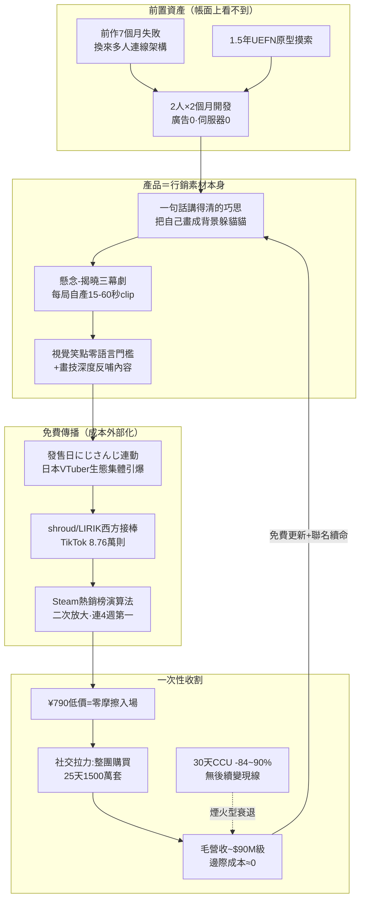

# MECCHA CHAMELEON（めっちゃカメレオン）商業模式全解剖

> **與 Last War 報告成對閱讀**：本報告沿用 [2026-07-22 Last War 報告](./2026-07-22-last-war-business-model-analysis.md) 的同一框架（時代背景／人口／社經／架構／心理／行銷／營收／可複製性），兩案是手遊買量模式 vs Steam 病毒模式的**鏡像對照**，§10 有全面對照表。
>
> **研究方法與證據等級**：5 個並行研究 agent 於 2026-07-22 完成（其中 2 個在寫完報告後因帳號月度花費上限被中斷，內容完整救回）。本環境 WebFetch 對外站幾乎全滅（五份合計 50+ 次嘗試全數 403），證據以 WebSearch 摘要多來源交叉為主；**銷量是本案唯一的例外亮點——累計銷量為開發者官方自報（X 公告經日媒轉載），非第三方估計**，可信度高於 Last War 的全部營收數字。營收金額仍是推算/單一來源，見 §13。附錄五份在 [資料夾](./2026-07-22-meccha-chameleon-business-model-analysis/)。**本篇未過獨立 verifier**（spend limit 中斷，改由主對話對 10+ 個關鍵數字逐一 grep 附錄複核），詳見 Update Log。

---

## 0. TL;DR — 三個問題直接回答

**Q1：這遊戲怎麼賺錢的？**
2 人團隊（レモリオン＋はがねいろ）、帳面開發 2 個月、**廣告費零、伺服器費零**（P2P＋Epic 免費後端），¥790/$5.99 買斷制，2026-06-10 上市後 **16 天賣 1,000 萬套、25 天 1,500 萬套**（官方自報），Niko Partners 稱 2026 年迄今賣最快的遊戲。以定價概算毛營收約 $9,000 萬、開發者稅前分成約 $6,900 萬（推算，見 §8）；另有日媒標題「2 個月營收 56 億日圓」（單一來源）。行銷全部外包給實況生態：發售日にじさんじ VTuber 連動引爆 → shroud/LIRIK 等西方實況主接棒 → TikTok #mecchachameleon 8.76 萬則貼文，Steam 全球暢銷榜連四週第一。

**Q2：它的本質是什麼？**
一台**開發者親口承認的「剪輯素材製造機」（クリップ製造機）**：把自己塗成背景躲貓貓，「塗得爛被抓」的瞬間天然是 15–60 秒短影音，笑點純視覺、零語言門檻，所以能跨日美歐同步病毒傳播。與 Last War 完全相反：Last War 花錢買眼球、靠痛苦感變現；MC 用產品的可看性換免費眼球、靠歡樂感賣入場券。**簡單在 Last War 服務獲客成本，在 MC 服務傳播速度；深度在 Last War 藏在錢包裡，在 MC 藏在畫技裡（課金買不到）。**

**Q3：這條路我能走嗎？**
**能走，但要當樂透票買，不能當商業計畫的基準情境。** 門檻不是資本（Steam 上架費 $100）而是：①多人連線工程（MC 的連線架構是前作 7 個月失敗作換來的——「2 個月奇蹟」不含前史）；②爆紅本質是機率事件（同一團隊前作慘敗 vs 本作 1,500 萬套，是「病毒性可完全設計」論的最強反證）；③爆紅也會急退燒（MC 同時在線 30 天內從 34 萬跌到 3.3 萬，-84~90%，是同類案例中最快）。中位數結果：Steam 上 75% 遊戲終身評論不到 50 則。正確姿勢見 §11。

---

## 1. 基本盤與銷售軌跡

| 項目 | 內容 | 證據等級 |
|---|---|---|
| 遊戲 | MECCHA CHAMELEON／めっちゃカメレオン（Steam App ID 4704690），2026-06-10 上市，僅 Steam PC，¥790/$5.99（上市初 20% 折扣至 6/16） | 事實 |
| 玩法 | 鬼隊 vs 變色龍隊：在全白角色身上即時作畫、偽裝成場景物件撐過時限；靈感來自開發者看到的「人體偽裝藝術家」電視節目 | 事實（訪談） |
| 團隊 | **2 人**：レモリオン（LEMORION，企劃/美術/主導）＋はがねいろ（Haganeiro，系統），自主發行 | 事實 |
| 前史 | 非首作：帳面開發 2 個月之前，有約 1.5 年 UEFN 原型摸索＋一款花 7 個月、商業失利的企鵝題材連線合作遊戲（**其多人連線架構被直接沿用**）——兩份附錄的前史細節略有出入（§13） | 事實（細節存疑） |
| 成本 | 廣告費 **0**（開發者自述，AUTOMATON WEST）；伺服器費 **0**（P2P host＋Epic Online Services 免費層） | 事實（官方口徑） |

**銷售軌跡（官方自報里程碑，經 Famitsu/4Gamer/電ファミ/Game*Spark 轉載）**：

| 日期 | 累計銷量 | 天數 |
|---|---|---|
| 06-12 | 50 萬 | Day 2 |
| 06-15 | 200 萬 | Day 5 |
| 06-20 | 500 萬 | Day 10 |
| 06-26 | **1,000 萬** | Day 16 |
| 07-05 | **1,500 萬**（最新查得；並公告與 HIKAKIN 聯動） | Day 25 |

配套數據：Steam 同時在線峰值 **340,534**（6/21，本波浪潮中僅次 Among Us 的 43.8 萬）；Steam 全球暢銷榜 W25–W28 連四週第一、W29 跌至第 4；評論查詢日全語言約 6.3–7.1 萬則、85–90% 好評（快照不一，§13）；Twitch 峰值觀看 23.8–28.5 萬、累積觀看約 5,100 萬小時。**生命週期現況：同時在線 7/22 約 3.3 萬，較峰值 -84~90%——爆紅已在退燒，但買斷制營收已一次性落袋，退燒不回溯傷害既有營收**（與 Last War 的服務型營收本質不同）。

## 2. 時代背景 — 為什麼是 2026 年、為什麼在 Steam

- **八年連續浪潮的最新一棒**：Among Us（2018 上市、2020 被 Twitch 引爆）→ Fall Guys（2020）→ Phasmophobia（2020）→ Lethal Company（2023，一人開發）→ Content Warning（2024）→ Chained Together（2024）→ R.E.P.O.（2025）→ **MC（2026）**。間隔越來越短：品類活躍，競爭者也在加速進場。
- **短影音已是 Steam 最大流量入口**：2025 年調查，Steam 願望清單來源占比——**短影音 35% ＞ Steam 站內 25% ＝ 朋友推薦 25% ＞ 直播 10% ＞ 開發者自有內容 5%**。「可剪輯性」從加分項變成流量主渠道，MC 是為這個結構量身打造的產品。
- **MC 走了非教科書路徑**：沒跑 Steam Next Fest、沒做願望清單長線造勢（上市前累積約 50–60 萬 wishlist 主要靠預告片自然轉發），直接靠上市日實況引爆＋Steam 熱銷榜演算法二次放大——代價是這條捷徑**完全不受開發者控制**。
- **與 Last War 的時代對位**：兩者其實吃同一個時代紅利的兩端——注意力碎片化＋短影音傳播。Last War 用它來**買**流量（素材即定位），MC 用它來**賺**流量（clip 即廣告）。

## 3. 人口結構 — 誰在買

- 直接的買家問卷查無；代理指標：桌遊/派對品類 47% 落在 18–34 歲；25–34 歲玩遊戲首要動機「和朋友連結」；「與朋友合作」是 Quantic Foundry 調查中最受歡迎的遊玩模式。**客群與 Last War 幾乎鏡像：年輕、單筆 $5.99、LTV 低，但每個買家自帶 2–4 個朋友的傳播力（產品內建 K-factor）**。
- **日本雙引擎結構**：起爆在日本（發售日にじさんじ連動、Steam 日本區週榜冠軍；にじさんじ VTuber「偽裝成滅火器/地板花紋」被專文報導），**放量在西方**（6/22 時英文評論數已是日文的 40 倍；shroud 1,130 萬追蹤者為本作最大咖實況主；wishlist 地區美國第一、中國第二）。日本 VTuber 事務所生態＝結構性免費宣發網（整個事務所集體連動），是歐美單點實況主引爆模式之外的日本特有加速器。
- 24 人房、官方建議 ≤13 人、私人房設計——產品面向「朋友局」而非陌生人排位，與買家結構互為因果。

## 4. 社會經濟 — 為什麼這個價格、這個時代成立

- **¥790 是決策摩擦最小化定價**：日文分析將低價列為爆紅三要素之一（低門檻＋SNS 上鏡畫面＋直播熱度）；Lethal Company 案例顯示即使朋友展示片段仍有人因價格猶豫——MC 把這個轉化瓶頸用低價直接碾平。「一杯飲料錢入場跟朋友笑一晚」在通膨時代是最容易過的心理帳。
- **失敗零代價的社交安全空間**：被抓不掉裝備、不影響進度、單局數分鐘——「爛」被制度化成內容而非羞辱，邀請不擅長遊戲的朋友沒有社交風險。對照 Last War 的「被打爆會真實損失資源」，兩者的社交情緒設計完全相反。
- **剪輯文化的經濟學**：行銷成本被外部化給剪輯者——剪片的人賺流量、遊戲賺曝光，開發者一毛不出。這在「切り抜き」（剪輯）已產業化的 2026 年才成立，2018 年的 Among Us 還得等兩年才被引爆。

## 5. 遊戲架構設計 — 「簡單」的另一種用法

- **核心循環**：數分鐘一局的「懸念-揭曉三幕劇」（獵人逼近 → 緊張堆疊 → 抓到/走過二選一），天然落在短影音黃金長度內。
- **塗色是真工具不是玩具**：調色盤＋雙滴管＋金屬度/粗糙度/自發光材質參數——**深度放在「畫技」這個課金買不到的維度**，高手偽裝成滅火器的影片本身又成為傳播素材，技巧深度直接反哺行銷。與 Last War「深度=消費階梯」形成準確鏡像。
- **為觀眾設計的機制**：開發者親口證實從立項就當「剪輯素材製造機」打造——減少文字閱讀、最大化「看了就懂」；「見落としランキング」（被看漏排行）把驚險瞬間量化成可炫耀的數字；技術下限不影響笑點供給（手殘也穩定產出內容）＝每一場直播都可能爆片。
- **商業化架構＝零**：無 DLC、無內購、無通行證；上市後以「數天一張新地圖」的頻率免費更新（大阪地圖、Minecraft/Backrooms 風社群地圖，約 6 週內版號推到 2.9.0+）＋聯名（HIKAKIN 官方合作地圖 7/11）對抗退燒。後續變現線目前不存在——這是它與 Last War 最徹底的分歧，也是它營收天花板的來源。
- **工程瑕疵（反面）**：好友邀請/配對功能上市滿月才修好（多篇評測點名「Friend Problem」）——核心賣點「跟朋友玩」曾被自己的 bug 打斷；自動繪圖外掛/ESP 氾濫部分未解；UI 被批醜陋混亂。**賣 1,500 萬套 ≠ 執行完美**，爆紅可以先於完美發生。

## 6. 心理學 — 歡樂驅動的六個機制（vs Last War 的恐懼驅動）

| 機制 | 理論 | MC 實作 |
|---|---|---|
| 笑點結構 | 良性侵犯理論（McGraw & Warren）：違反預期＋安全無害＝好笑 | 「我以為藏得很好」被一槍戳破＝侵犯；短局、零損失、卡通化＝良性。**塗得爛被抓比塗得好躲過更好笑**——躲過只有懸念沒有意外 |
| 傳播 | 視覺幽默零語言門檻 | 人形物體偽裝滅火器，任何國家觀眾 3 秒看懂——跨語言病毒傳播的結構性原因 |
| 表演 | 社會臨場感：派對遊戲的精彩來自情境荒謬而非主播技術 | 每局必有「開獎瞬間」＋反應鏡頭；低技術主播也能穩定產出內容 |
| 購買 | 社交拉力購買（social-pull）＋低價衝動決策 | 看實況 → 想跟朋友玩 → 每人 ¥790 全團入場；wishlist 上市日衝到 60 萬的「內容先行、購買在後」路徑 |
| 留存 | 新奇感遞減（享樂適應）——無外加黏著機制 | 退坑零成本、零愧疚（無簽到/公會義務/沉沒成本）；30 天 CCU -84~90% 是這個設計的必然代價 |
| 身分隱喻 | （軟性評論，供參考）「不想顯眼卻想被看見」的現代人心理 | 變色龍=在不同場域把自己塗成不同顏色求生存的隱喻（note 專欄前遊戲企劃的詮釋，非實證） |

**與 Last War 心理對照的核心句**：Last War 把玩家的痛苦放大到剛好能用付費緩解的程度來持續變現；MC 把「加入的樂趣」放大到一次性低價立刻兌現，之後不再需要任何心理槓桿——前者風險是情緒疲勞與反感（1 星如潮），後者風險是熱度本身就是唯一資產，梗玩完衰退幾乎必然（已在發生）。

## 7. 行銷模式 — 零預算的病毒機器（含「零」的真相）

- **可考證的傳播鏈**：上市日（6/10）にじさんじ大人數連動配信起爆 → しぐれうい等日本實況圈接力 → 西方 shroud/LIRIK/caseoh_ 放大 → TikTok #mecchachameleon 8.76 萬則、累積觀看 5,100 萬小時 → 7/11 HIKAKIN 官方聯名地圖維持熱度。官方動作僅：預告片（上市後一週才補發正式版）、X 公告、快速更新。
- **「零廣告費」的三個折扣**：①上市前已有 50–60 萬願望清單＋三款前作粉絲底子，不是絕對零起點；②被にじさんじ選中帶隨機性（「單一僥倖」解讀空間存在）；③「付費請實況主」陰謀論流傳中——僅開發者本人否認，無第三方查證；HIKAKIN 合作是否涉金錢未揭露。
- **寄生生態＝病毒性的量化證據**：mecchamobile.com（offerwall 詐騙型「免費手機版」）、自稱 OFFICIAL SITE 的 mecchachameleonmobile.com、SEO 農場仿作、App Store/Google Play 偽 App（日媒示警）、冒牌 SNS 帳號（官方 6/30 公開警告）——需求外溢到寄生者值得詐騙的程度，與當年 Among Us/Wordle 的寄生潮同構。
- **與 Last War 對照**：30 萬條付費素材 vs 8.76 萬則玩家自製 TikTok——**素材由誰生產、誰出錢**是兩個模式的分水嶺。Last War 的買量可回測、可規劃、可持續（有錢就行）；MC 的病毒不可控、不可保證、不可重來。

## 8. 營收獲利模式

- **收入＝銷量 × 單價，一次性落袋**：1,500 萬套 × $5.99 概算毛營收 ~$8,985 萬（未計退款/區域定價/首週 20% 折扣，屬上限值）；套 Steam 累進拆帳（**30% → $1,000 萬以上 25% → $5,000 萬以上 20%**——注意不是傳言的「100 萬美元小額條款」，那是 Apple 的規則）開發者稅前約 $6,900 萬（自行推算）。對照單一日媒標題「2 個月營收 56 億日圓（≈$35–38M）」——口徑不明（可能為開發者分成後或較早時點），並陳於 §13。**即便取下緣，2 人團隊兩個月入帳數十億日圓級**。
- **成本結構**：前置沉沒（人力 2 個月＋前作攤提）＋$100 上架費＋零伺服器＋零買量 → **爆紅後每一套邊際成本趨近零**。對照 Last War「買量占營收 50–60%、租曝光」的租賃型現金流，MC 是「成本前置、銷量即純利」的資產型現金流——對小團隊友善得多，前提是跨過「會不會爆」的機率門檻。
- **退款規則（14 天/2 小時）**：對「反覆跟朋友玩」的派對遊戲傷害小（不像 2 小時破關的短流程單機被系統性退款）；風險點反而是「連不上朋友」的技術性退款。
- **後續變現＝目前不存在**：無 DLC/皮膚商城計畫查得；同類先例（R.E.P.O. 用遊戲內代幣換外觀、Lethal Company 官方不變現靠社群 mod）顯示這個品類的長尾變現本來就薄。**MC 的營收模式是一支煙火，不是一台年金機器**——這是與 Last War 最終極的差異。

## 9. 商業架構總圖

**一句話公式**：`（前作換來的技術資產 × 一句話巧思 × 每局自產 clip 的機制） × （VTuber/實況生態免費引爆 × 低價零摩擦入場） × 一次性買斷收割`——與 Last War 公式的每一項都互為鏡像。

## 10. 與 Last War 全面對照表（本報告核心交付）

| 維度 | Last War: Survival | MECCHA CHAMELEON |
|---|---|---|
| 商業模式 | F2P＋IAP 深井（服務型年金） | 買斷 $5.99（一次性煙火） |
| 團隊/開發 | 51–200 人、20 個月＋千人級同業對標 | 2 人、帳面 2 個月（實質含前史約 9 個月＋1.5 年原型） |
| 獲客成本 | 買量占營收 50–60%，30 萬條素材 | 0（外部化給實況/剪輯生態） |
| 「簡單」的功能 | 壓低 CPI、擴大受眾漏斗 | 壓低理解/實況門檻、最大化傳播速度 |
| 深度藏在哪 | 錢包（VIP18=5,000 萬點）＋聯盟義務 | 畫技（課金買不到）＋場景創意 |
| 核心情緒 | 恐懼/焦慮（怕落後、怕辜負隊友） | 歡樂/驚喜（一起笑） |
| 留存機制 | 義務型（簽到/聯盟/沉沒成本），退坑高成本 | 自願型，退坑零成本 → 30 天 -84~90% |
| 玩家滿意度 | 過半 1 星卻營收榜首（滿意度與營收脫鉤） | 85–90% 好評（滿意度=傳播=營收同向） |
| 營收規模 | 年 $15.7–16.5 億、終身 ~$35 億 | 一個半月毛營收 ~$0.9 億（上限概算） |
| 營收品質 | 持續但需持續買量餵養；法律風險升高 | 一次落袋、退燒不回溯；無監管爭議 |
| 單用戶價值 | 鯨魚 LTV 數千至數十萬美元 | 人均 $5.99，靠人頭數 |
| 可複製性門檻 | 資本（數千萬美元買量池）＝拍賣門檻 | 技術（多人連線）＋機率（被實況圈選中） |
| 對 Jake 的意義 | 1:1 不可行；證明「輕殼重核」公式 | 可入場；證明「小團隊+可剪輯巧思」上限存在 |

## 11. 可複製性評估 — 三條路線的完整決策框架

Jake 目前檯面上三條路（前兩條來自 Last War 報告 §11，本節新增第三條後統一比較）：

| 維度 | ① Last War 買量路線 | ② 微信/抖音小遊戲 | ③ Steam 病毒式派對遊戲（本案） |
|---|---|---|---|
| 起始資本 | 極高（買量即門票） | 低–中（單次試錯 ~2 萬人民幣） | 極低（$100 上架費＋人力） |
| 成功的性質 | 可購買、可回測（ROAS） | 半設計（平台分享機制）半政策風險 | **高度機率性**，引爆不可控 |
| 中位數結果 | 資本不足→虧損出局 | 小額廣告分潤，有底但低 | 落入「75% 評論<50 則」組，難回本 |
| 上檔案例 | —（已判不可行） | 《遺棄之地》5 人 5 天 250 萬人民幣 | **MC：2 人 25 天 ~$9,000 萬毛營收** |
| 隱藏門檻 | 資本拍賣 | 平台政策依賴 | **多人連線工程**（AI 幫不太上）＋心理韌性（前作失敗要撐得過） |
| 判定 | 不可行 | **基準路線**（期望值最穩） | **樂透票**（小成本買上檔空間） |

**本案給的三個具體修正**（相對於「看到 2 人 2 個月就衝」的天真解讀）：
1. **先還技術債再買彩票**：MC 的連線架構是前作 7 個月換來的。若走路線③，第一款作品的目標應是「練成多人連線技術＋不虧上架費」，不是爆紅——這正是 LEMORION 實際走過的順序。
2. **把爆紅當意外之喜**：同團隊前作慘敗 vs 本作 1,500 萬套＝病毒性含不可設計的機率成分；基礎率（現象級爆紅 <0.1%）決定了商業計畫不能建立在「會爆」上。可設計的部分只有：一句話講得清的巧思＋每局自產 clip 的機制＋低價＋≤13 人低門檻連線。
3. **爆了也要快收**：注意力經濟周轉在加速（MC 退燒速度是同類最快），爆紅視窗會越來越短——買斷制「先收錢」的結構因此反而比服務型更適合小團隊（衰退不回溯營收）。
4. **路線②③可以串聯**：用②的低成本試錯驗證「巧思是否好笑/可剪輯」（微信小遊戲或 itch.io 網頁版），驗證過的概念再投入③做 Steam 多人版——兩條路共用同一個核心資產（一句話巧思），風險分層遞進。

## 12. 反面訊號與否證條件

**反面訊號彙總**（詳附錄 macro §5、§8）：基礎率 <0.1%；同團隊前後作對照（最強單一反證）；倖存者偏差結構性存在（失敗者不寫覆盤）；MC 自身 30 天退燒 -84~90%；賣 1,500 萬套的遊戲配對功能壞了一個月（爆紅≠執行完美）；派對品類 2026 年不在 Steam 需求成長前三、分類下已 685 款競爭。

**本報告結論在以下情況作廢或需重審**：
- 若 MC 後續推出付費 DLC/皮膚商城且營收顯著（推翻「一次性煙火、無後續變現」判定）；
- 若查實開發者有未披露的行銷投入（付費實況合作實錘），「零廣告費病毒模式」敘事需改寫；
- 若 2026 H2 再出現 2 個以上同量級（CCU>20 萬）病毒式派對遊戲，「爆紅是稀有事件」的機率估計需上修；
- 若 MC CCU 在 3 個月內回升至 10 萬以上（推翻「煙火型衰退」判定）。

## 13. 數據衝突清單（引用前必看）

| 項目 | 並存數字 | 處理 |
|---|---|---|
| 營收 | 毛營收 ~$8,985 萬（15M×$5.99 自行概算，上限）vs「2 個月 56 億日圓」（livedoor 單一標題，口徑不明）vs Gamalytic 早期快照 $8.7M（僅 3M 套時點） | 並陳；銷量（官方自報）可信度高於一切金額換算 |
| 評論數 | 34,943（英文子集/90%）/ 51,507（近 30 天?/87%）/ 62,872 / 71,086（全語言/87%）四組快照 | 高速成長期的時點差＋Steam 過濾機制；引用時標快照日 |
| 前史 | 「1.5 年 UEFN 原型」（psychology 附錄）vs「前作 LINK Penguins 7 個月、連線架構沿用」（macro 附錄）vs「前作 Penguin Hotel 系列/Death Burger」（company 附錄） | 不互斥但細節出入；共同結論=「2 個月」不含前期累積 |
| CCU 衰退 | -84%（一追蹤站）vs -61%/現存 13.3 萬（另一站）vs 7/22 即時 3.3 萬 | 方法論不同；方向一致（大幅退燒），取 -84~90% 區間 |
| Twitch 峰值觀看 | 23.8 萬 vs 28.5 萬 | 追蹤站口徑差，取區間 |
| 願望清單 | 上市前 50 萬（marketing）vs 上市日 60 萬（psychology，公布日 11 萬起算） | 時點差，非矛盾 |
| 上市日にじさんじ連動 | 「官方選中/自發遊玩」兩種敘事 | 是否官方安排查無，僅確認發生 |

## 14. 附錄與複查

五份子報告（全部來源 URL＋事實/推論/不確定標註＋各自 403 清單）：

- [公司與銷售](./2026-07-22-meccha-chameleon-business-model-analysis/research_mc_company_sales.md)・[遊戲架構](./2026-07-22-meccha-chameleon-business-model-analysis/research_mc_game_design.md)・[心理學與病毒性](./2026-07-22-meccha-chameleon-business-model-analysis/research_mc_psychology.md)・[行銷傳播](./2026-07-22-meccha-chameleon-business-model-analysis/research_mc_marketing.md)・[宏觀與可複製性](./2026-07-22-meccha-chameleon-business-model-analysis/research_mc_macro_replication.md)

Mac 複查優先頁（已併入 mac-manual-homework 07-22 段）：Steam 商店頁原文（售價/評論數核對）、電ファミ開發者訪談逐字稿（「剪輯素材製造機」關鍵引述）、SteamDB 完整同接歷史、PC Gamer/Kotaku 評測全文、gamebiz 日本區週榜原文。

## Update Log
- 2026-07-22 v1.1：spend limit 解除後補派獨立 verifier，8 項驗收條件全數通過（10+ 抽查數字全數溯源至附錄、矛盾清單完整、索引三處一致），零修正項。
- 2026-07-22 v1.0：建檔。5 subagent 並行研究（其中 psychology、macro_replication 兩個 agent 在完成報告寫入後因帳號月度 spend limit 被中斷，檔案完整救回）＋主對話彙整。v1.0 當下未過獨立 verifier（同一 spend limit 無法派 agent），替代驗證為主對話 grep 複核。
